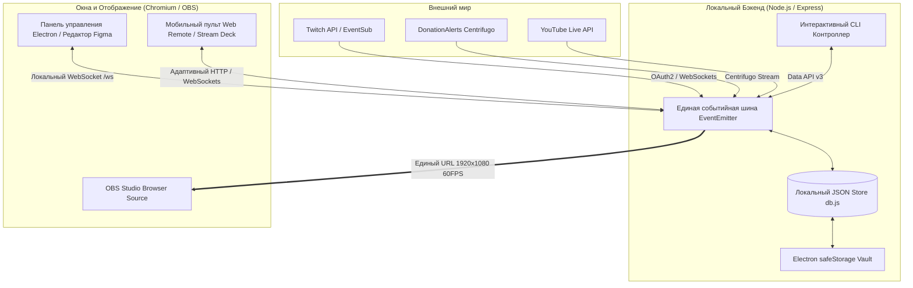

# Open Stream Environment

Стрим-оверлей в стиле Material Design 3 + интуитивный визуальный редактор
(в стиле drag-and-drop, аналогично механикам Figma) — перетаскивание, ресайз,
добавление/удаление виджетов на лету, собранные на Electron. Оверлей отдаётся локальным сервером как обычная веб-страница —
её нужно добавить в OBS как Browser Source.

Текущая версия: **2.5.2**.

## Что внутри

- **Панель управления** (`control/`) — окно Electron с двумя экранами:
  - **Редактор** — канвас 16:9 с превью оверлея, библиотека виджетов слева,
    слои и свойства выбранного виджета справа. Виджеты перетаскиваются,
    ресайзятся за уголки, добавляются кликом/перетаскиванием из библиотеки,
    удаляются кнопкой корзины или клавишей Delete.
  - **Настройки** — подключение Twitch / DonationAlerts / YouTube / OBS
    WebSocket, Soundboard, Stream Deck, ссылка на оверлей, смена порта и
    сброс раскладки.
- **Оверлей** (`overlay/`) — страница, которую видит зритель: рендерит ту же
  раскладку виджетов с реальными данными (алерты, чат, цель доната,
  последние события).
- **Локальный сервер** (`server/`) — Express + WebSocket, общая шина между
  панелью управления, оверлеем и интеграциями (Twitch, DonationAlerts, YouTube, а также архитектурный задел под MemeAlerts).
  Раскладка оверлея хранится в локальном JSON-файле `config/local-db.json`,
  остальные настройки — в `config/config.json` (создаётся автоматически при
  первом запуске из `config/config.example.json`).
- **Локальная база данных** (`config/local-db.json`) — сохранение раскладки оверлея и истории
  стрим-событий (донаты/подписки/фоллоу) между сессиями.
- **Колесо Фортуны** — интерактивный псевдо-3D барабан (CSS 3D Transforms +
  Canvas) с адаптацией под системные темы оформления.
- **Розыгрыши среди зрителей чата** — сбор участников по команде, фильтрация
  дубликатов (`Set`), перемешивание Фишера-Йетса и режим на выбывание.
- **Голосование в чате** — отдельная полноэкранная сцена с живой диаграммой
  (столбики или круг); зрители голосуют командой (`!poll 1`, `!poll 2`, …),
  пункты, команда и тип диаграммы настраиваются в панели «Голосование» (кнопка
  в шапке), голоса обновляются в реальном времени.
- **Единый виджет алертов** — объединяет события Twitch, DonationAlerts и
  уведомления Колеса Фортуны в общую очередь.
- **Виджет «Участники розыгрыша»** — полноценный виджет Редактора: карточка в
  библиотеке, предпросмотр на канвасе, слой для управления видимостью/Z-index
  и настройки (количество имён, шрифт, цвет, прозрачность, бегущая строка) в
  правой панели свойств.
- **Звуковое сопровождение розыгрыша** — музыка вращения барабана с затуханием,
  звуки победы/выбывания и настраиваемая громкость в панели управления.
- **Регулировка скорости Колеса Фортуны** — от «медленно» до «быстро» (1–5),
  сохраняется в локальной БД и влияет на число оборотов/длительность вращения.
- **Полная адаптивность (Responsive Design)** — панель управления и 3D-оверлеи
  автоматически масштабируются под любые разрешения экрана (от Full HD до
  2K/4K) без потери качества графики и читаемости текста.
- **Система тем оформления** — встроенные 2D-темы Material You, Orbital,
  Pixel Perfect и Elite, а также их 3D-варианты Star Citizen (Grim HEX),
  Nuclear и Cobra Mk II с неоновыми 3D-виджетами. Тема выбирается одной
  карточкой; тумблер «3D» включает её 3D-вариант.
- **Локализация (RU/EN)** — русский и английский интерфейс для панели
  управления, оверлея, сцен и Колеса Фортуны. Язык переключается в настройках,
  сохраняется в локальной БД и мгновенно применяется во всех открытых окнах.
- **Виджет «Визуализатор микрофона»** — живая звуковая волна с микрофона
  (Web Audio API + Canvas, ~60 FPS), с настройками чувствительности, толщины
  линии, цвета и прозрачности; в тишине превращается в плавную горизонтальную
  линию, а в редакторе показывается фейковая волна для предпросмотра. Три
  режима отрисовки: **плавная синусоида**, **частотные столбики** (эквалайзер)
  и **круговой визуализатор** (кольцо вокруг центра).
- **Встроенный терминал логов** — панель реального времени в панели управления
  (кнопка «Логи» в шапке): структурированные логи сервисов (Twitch,
  DonationAlerts, сервер) с подсветкой уровней и сервисов, автоскроллом,
  кнопкой очистки и лимитом 500 строк.
- **Всплывающие уведомления** — в правом верхнем углу панели управления
  появляются карточки о новых событиях (фоллоу, подписка, гифт-подписка,
  чир, донат) и автоматически исчезают через несколько секунд. Если панель
  свёрнута в трей или не в фокусе, эти же события приходят нативными
  OS-уведомлениями. Ко всем уведомлениям можно включить звуковой сигнал
  и настроить его громкость (переключатель и слайдер в
  «Настройки → Приложение»).
- **Интеграция YouTube Live** — чат прямого эфира и события (Super Chat,
  Super Sticker, новые участники) через YouTube Data API v3.
- **Управление интеграциями** — переключатели включения/отключения Twitch,
  DonationAlerts и YouTube прямо в настройках.
- **Soundboard (Шумотека)** — запуск звуков и анимаций за баллы канала Twitch
  (channel points): маппинг наград на аудио/GIF с диска, громкость, режим
  очереди.
- **Озвучка донатов (TTS)** — текст доната из DonationAlerts зачитывается
  голосом прямо в оверлее (Web Speech API): вкл/выкл, громкость, скорость,
  язык и выбор голоса в Настройках → DonationAlerts, с кнопкой «Тест озвучки».
- **OBS WebSocket** — переключение сцен, кастомные RAW-команды, мультикамера
  (ракурсы за баллы) и «Эффекты/Фильтры камеры» (Ч/Б, размытие, пикселизация,
  хромакей по таймеру или тумблером).
- **Плагин Elgato Stream Deck** — переключение сцен (старт/BRB/колесо/
  разговор/main/конец/голосование) с подсветкой активной сцены и своими иконками.
- **Сцена «Разговор» (Just Chatting)** — фон, крупный чат справа (слева место
  под вебку) и всплывающие алерты.
- **Заставки между сценами** — на сценах «Начало / BRB / Разговор / Окончание /
  Колесо / Голосование» задаётся видео/картинка/GIF, который проигрывается при
  переключении сцен; авто-переход по окончании видео или по таймеру (авто или
  1–30 сек). Настраивается в отдельной вкладке «Заставки».
- **Тест чата** — кнопка в шапке панели управления отправляет несколько
  тестовых сообщений для проверки чата и сцены Just Chatting.
- **Настройка порта** — порт локального сервера меняется на вкладке
  «Настройки → Приложение» и применяется сразу, без перезапуска приложения.
  Панель управления сама переподключается к новому порту; источник в OBS
  (Browser Source) нужно обновить на новый адрес вручную.
- **Режим редактирования HUD** — прозрачный оверлей поверх игры (Borderless
  Window) для перетаскивания и ресайза виджетов прямо в игре; хоткей по
  умолчанию Control+Shift+H, выбор монитора в настройках.
- **Чат поверх игры** — прозрачное плавающее окно чата поверх игры (клики
  проходят насквозь) для одномониторных стримов; хоткей по умолчанию
  Control+Shift+L, настройки размера, позиции, прозрачности и шрифта.

Все виджеты можно класть на канвас в любом количестве и любом месте:
**Алерты**, **Цель доната**, **Чат Twitch**, **Последние события**, а также
**Свой виджет** (текст, картинка или произвольный HTML — см. ниже),
**Счётчик** (фолловеры/подписчики Twitch или топ донат сессии),
**Соц. баннер** (по очереди показывает соцсети из списка),
**Участники розыгрыша** (список зрителей) и **Визуализатор микрофона**
(анимированная звуковая волна).

## Оформление (темы)

На вкладке «Настройки» → «Оформление» каждая тема — это «семья»: базовая
2D-палитра и, у части тем, необязательный 3D-вариант, который включается
тумблером «3D» прямо на карточке темы.

Базовые темы задают палитру оверлея, сцен и Колеса Фортуны:

- **Material You** — фирменная синяя палитра приложения (Material 3),
  стеклянные полупрозрачные панели с блюром, бейдж-пилюля у лейбла алерта
  (по умолчанию). 3D-вариант — **Material You 3D**.
- **Orbital** — HUD-стиль в духе Star Citizen: строго прямые углы без
  скругления, 4 уголка-скобы на каждом углу панели, лёгкие сканлайны,
  фоновая сетка-текстура на сценах, циан/янтарь/красный акценты, шрифты
  Orbitron/Rajdhani. 3D-вариант — **Star Citizen**.
- **Pixel Perfect** — минималистичный тёмный интерфейс в пиксельном стиле:
  почти чёрные нейтральные поверхности, плоские 1px рамки и приглушённый
  золотой акцент; сжатый шрифт PT Sans Caption (текст и данные), чат — Roboto
  Condensed. 3D-вариант — **Pixel Perfect 3D**.
- **Elite** — оранжевый HUD в духе Elite Dangerous: прямые углы, лёгкие
  сканлайны и фирменный оранжевый акцент Faulcon DeLacy (`#ff7605`) с
  циановым/красным для акцентов. 3D-вариант — **Cobra Mk II**.
- **Nuclear** — холодный CRT-терминал: зелёный фосфор и сканлайны; 3D-вариант
  добавляет радиоактивные виджеты (знак радиации, чат, донат-цель, голо-алерт).

Тумблер «3D» включает неоновые 3D-виджеты поверх той же палитры:

- **Material You 3D** — мягкая 3D-сфера с орбитой, чат на приподнятой
  карточке, градиентная донат-цель и всплывающий алерт с вращающимся значком.
- **Pixel Perfect 3D** — прозрачный каркасный изометрический пиксель-куб,
  скрытый до первого алерта: на всех его гранях отображается иконка активного
  алерта (вращается вместе с кубом), пиксельный чат, блочная шкала донат-цели
  и пиксельный алерт.
- **Star Citizen (Grim HEX)** — 3D-вариант Orbital: вывеска Grim HEX,
  вывеска Café Musain, чат, донат-цель и голографический терминал.
- **Cobra Mk II** — 3D-вариант Elite: голограмма корабля, вывеска Elite
  (неоновая эмблема Elite Dangerous), чат, донат-цель, голо-алерт, щит-цель
  с кольцами и перспективный радар, где донатеры появляются как корабли на
  сенсоре.
- **Nuclear** — 3D-виджеты: знак радиации, чат, донат-цель и голо-алерт.

Когда 3D включён, его виджеты появляются поверх базового оверлея, а
соответствующие 2D-виджеты (чат, цель, алерты) автоматически заменяются
3D-версиями, сохраняя позицию и размер; при выключении 3D они возвращаются к
2D-виду. Явно расставленный 3D-чат/цель/алерт следует за сменой темы — один и
тот же виджет превращается в аналог новой темы (Material You → Star Citizen →
Pixel Perfect → ...). Декоративные 3D-виджеты (вывески, радар, щит, сфера, куб)
тоже следуют за темой: вывеска заменяется вывеской, радар — радаром; если у
активной темы нет аналога, виджет скрывается на оверлее и не отображается на
канвасе редактора (в списке слоёв остаётся с пометкой «выкл»). У активной
3D-темы внизу появляется список «3D-виджеты» —
каждый из них можно включить или выключить отдельным тумблером (например,
оставить только сферу и цель, без чата). Канвас редактора, список слоёв и
панель свойств показывают виджеты уже в эффективном виде текущей темы. Тема
влияет только на сам оверлей и его превью на канвасе — панель управления
(топбар, библиотека, настройки) всегда выглядит одинаково.

Кнопки «Создать свою тему» и «Изменить» открывают полноценный редактор темы в
отдельном окне. Помимо 4 цветов-затравок (основной, второй, третий, фон —
остальная палитра контейнеров и `on-*` цветов считается автоматически) доступны
гранулярные настройки: семь форм панелей (скруглённая, угловатая/HUD, острая,
мягкая, капсула, скобки по четырём углам, Hazard), гарнитуры отдельно для
заголовков / основного текста / данных (таймеры, суммы), толщина/стиль/цвет
рамки, свечение (цвет + интенсивность), цвет фона и текста, прозрачность панелей
и размытие фона. Для продвинутых есть отдельный CSS-редактор в духе Notepad++
(подсветка синтаксиса, автодополнение свойств/значений/`var(--…)`/селекторов,
проверка синтаксиса, поиск/замена, отмена/повтор и строка состояния), который
подгружается как `<style id="ose-custom-theme-css">` в оверлей и канвас.
Изменения видны сразу: кнопка «Превью в окне» открывает живое превью черновика,
кнопка «Сэмплы» — набор тестовых карточек (алерт, чат, цель, голосование).
Тему можно продублировать, сбросить переопределения к авто, а также
экспортировать и импортировать в отдельный JSON-файл. У своих тем 3D-варианта нет.

## Локализация

Интерфейс переведён на русский и английский. Язык переключается кнопками
RU/EN в шапке панели управления и сохраняется в локальной БД
(`local-db.json` → `language`), поэтому выбор переживает перезапуск
приложения. Изменение мгновенно уходит во все окна: панель управления,
оверлей, сцены и Колесо Фортуны.

Переводы лежат в `shared/locales/ru.json` и `en.json` (плоские пути через
точку, например `giveaway.start`, с подстановкой `{{name}}`). Хелпер
`shared/i18n.js` предоставляет `I18n.t('ключ', { ... })`, а статичные
подписи в HTML переводятся атрибутами `data-i18n` / `data-i18n-placeholder` /
`data-i18n-title`. Чтобы добавить язык — создайте ещё один JSON в
`shared/locales/`, подключите его в `server/index.js` (`LOCALES`) и добавьте
кнопку в переключатель.

## Сетка и соотношение сторон

В тулбаре под канвасом есть селектор «Сетка»: Выкл / 2% / 5% / 10% —
включает видимую сетку и прилипание при перетаскивании/ресайзе виджетов к
этому шагу (в процентах канваса).

Рядом — селектор «Соотношение»: задаёт пропорции канваса редактора
(16:9, 16:10, 21:9, 32:9, 4:3, 1:1, 9:16, 3:4). Раскладка хранится в
процентах, поэтому при смене пропорций виджеты сохраняют позицию; сам
оверлей всегда занимает весь источник OBS (100vw/100vh), так что для
вертикальных (9:16) или ультрашироких (21:9) стримов достаточно выбрать
соответствующее соотношение канваса и задать его же в OBS Browser Source.

## Пресеты раскладки

В тулбаре под канвасом есть блок «Пресеты»: текущее расположение виджетов
можно сохранить под именем, а затем загрузить или удалить из выпадающего
списка. Кнопка «Сохранить» перезаписывает выбранный в списке пресет; если
ничего не выбрано — создаёт новый по введённому имени. Вместе с раскладкой
пресет сохраняет активные 2D/3D-темы, поэтому при загрузке 3D-пресета его
Star Citizen-виджеты сразу становятся видимыми. Пресеты хранятся в
`config/local-db.json` и не затрагивают остальные настройки.

## Экспорт / импорт настроек

На вкладке «Настройки» внизу — «Экспорт / импорт настроек»: экспорт
сохраняет копию `config.json` (раскладка, темы, цель, токены Twitch/
DonationAlerts) в выбранный файл через системный диалог; импорт читает такой
файл, полностью заменяет текущие настройки и на лету переподключает
интеграции. Файл экспорта содержит секреты — не выкладывайте его публично.

## Свой виджет

В библиотеке виджетов есть «Свой виджет» — у него четыре режима (переключаются
в панели свойств справа):

- **Текст** — заголовок + текст, выравнивание, размер, опциональный фон-карточка.
- **Изображение** — URL картинки + вписывание (contain/cover).
- **Свой HTML** — кнопка «Редактировать код» открывает отдельное окно с
  вкладками HTML / CSS / JS и живым превью. JS выполняется по-настоящему
  (виджет рендерится через `<iframe>` с полноценным HTML-документом, а не
  просто вставкой в страницу) — можно использовать таймеры, анимации,
  запросы и любой код. Это локальное приложение только для вас, так что
  ограничений на содержимое нет — как в Browser Source самого OBS.
- **Встраивание (iframe)** — ссылка на внешний браузер-источник (например,
  виджет ЯП! от DonationAlerts), который встраивается как есть.

## Окно чата

Кнопка «Чат» в топбаре панели управления открывает отдельное окно с
лентой сообщений Twitch-чата — удобно держать сбоку экрана и следить за
чатом во время стрима, не переключаясь в браузер. Сообщения можно не только
читать, но и отправлять: внизу есть поле ввода с кнопкой «Отправить».
Публикация идёт через Twitch Helix от имени стримера, поэтому для отправки
нужно один раз подключить Twitch (см. раздел «Twitch» ниже). Историю не
хранит — показывает сообщения, пришедшие пока окно открыто.

Отдельно есть режим **«Чат поверх игры»** (Настройки → Чат поверх игры или
глобальный хоткей по умолчанию Control+Shift+L): прозрачное плавающее окно
поверх игры, которое всегда поверх остальных окон и пропускает клики
насквозь — полезно на одном мониторе. В настройках задаются монитор, размер
и положение окна, прозрачность фона и размер шрифта. Это окно только для
чтения — поле отправки в нём скрыто.

## Web Remote / OBS

В шапке панели управления показывается адрес мобильного пульта
(`http://<IP_ПК>:8710/remote`). Открыв его на телефоне в той же Wi-Fi сети,
можно управлять оверлеем: переключать сцены (старт/BRB/разговор/конец/колесо),
запускать Колесо Фортуны (включая генерацию секторов), менять счётчик смертей,
запускать тестовые алерты, менять тему, а также переключать ракурсы камеры и
включать эффекты/фильтры. Пульт состоит из трёх вкладок: «Управление»
(быстрые действия), «Колесо» (настройки розыгрыша) и «Чат» — живая лента
сообщений стрима (Twitch/YouTube) с автоскроллом, подсветкой ника/бейджей и
полем ввода для отправки сообщений в чат Twitch.

Для переключения сцен в OBS включи `OBS WebSocket` (OBS 28+:
`Tools → WebSocket Server Settings → Enable WebSocket Server`) и заполни
карточку «OBS WebSocket» в настройках: host/порт/пароль, маппинг имён сцен
(логическое имя пульта → имя сцены в OBS), ракурсы камеры и эффекты/фильтры.

## Стек и системные требования

- Node.js 18+ и Electron 31.
- Локальное хранилище данных — JSON-файл `config/local-db.json` для
  раскладки и истории событий; `config/config.json` — для остальных настроек.
- Для псевдо-3D компонентов оверлея (Колесо Фортуны) используется аппаратное
  GPU-ускорение через CSS 3D Transforms поверх HTML5 Canvas.

## 📐 Архитектурные принципы и оптимизация

- **Zero-CPU Idle & Рендер-стратегия:** Проект спроектирован с разделением на пассивный 2D-слой (Material Design 3) и тяжелый 3D-слой телеметрии. Трехмерные виджеты (радары, голограммы) используют процедурный цикл `requestAnimationFrame` с жестким ограничением FPS, который автоматически засыпает (`setIdle(true)`), если на экране нет анимаций или виджет скрыт. Это гарантирует 0% нагрузки на GPU/CPU стримера вхолостую.
- **Детерминированная симуляция физики:** Анимации элементов (например, дрейф кораблей на радаре Grim HEX или вращение Колеса Фортуны) используют временные снимки начального состояния (`performance.now()`). Расчет координат идет от дельты времени, что предотвращает лаги, телепортации или рассинхроны графики оверлея даже при просадках FPS в тяжелых играх.
- **Изолированный «Песочный» запуск (Sandbox iFrames):** Компонент «Свой виджет» рендерится внутри изолированного `<iframe>` с полноценным HTML-документом. Кастомный пользовательский JS-код выполняется в собственной изолированной среде, благодаря чему ошибки в скриптах пользователя физически не могут уронить основную WebSocket-шину или сломать рендеринг системных алертов.
- **Локальный аудио-мост (Mic Bridge):** Для обхода политик безопасности OBS Browser Source (который блокирует захват аудио без HTTPS), Electron-бэкенд захватывает системный микрофон через десктопные привилегии Node.js, выполняет downsampling потока частот и транслирует легковесные дельта-пакеты (64/240 байт) по локальному сокету в оверлей, обеспечивая живой эквалайзер в ~60 FPS.
- **Криптографическая защита секретов (Secret Vault):** Все конфиденциальные данные стримера (токены авторизации Twitch, YouTube, DonationAlerts, пароли OBS WebSocket) шифруются на лету алгоритмами AES-256 через нативный Electron `safeStorage` (используя DPAPI в Windows / Keychain в macOS / libsecret в Linux). Ключи никогда не хранятся и не передаются в открытом виде.



## Установка и запуск

Нужен Node.js 18+. Установка зависимостей:

```bash
npm install
npm start
```

При запуске сначала на пару секунд появится сплеш-скрин, потом откроется
окно панели управления. Оверлей для OBS в это время уже доступен по
адресу, который показан внизу канваса и на вкладке «Настройки» — по умолчанию:

```
http://localhost:8710/overlay/overlay.html
```

Добавьте его в OBS: **Источники → + → Browser Source**, вставьте URL,
разрешение 1920×1080, включите «Обновлять браузер при активации сцены».
Прозрачность работает из коробки — фон оверлея прозрачный.

Можно также поднять только сервер без Electron-окна (удобно для отладки
самого оверлея в обычной вкладке браузера):

```bash
npm run server:only
```

## Тестирование

Тесты написаны на Jest и лежат в `tests/`. Запуск:

```bash
npm test
```

Покрытие (15 наборов, 75 тестов):

- `db` — создание коллекций, история донатов, очистка;
- `giveaway` — дубликаты участников, перемешивание, режим выбывания;
- `donationalerts` — парсинг Centrifugo-событий;
- `state` — конфиг OBS/ракурсы/фильтры/Soundboard/Stream Deck, порт, победитель;
- `i18n`, `events`, `logger`, `storage-paths` — утилиты;
- `obs-websocket` — OBS v5 auth и план переключения ракурсов;
- `camera-angles`, `camera-filters` — матчинг наград Twitch;
- `server-utils` — генерация тестовых алертов и запись истории.

## Twitch

**Чат** подключается сразу и анонимно — никаких токенов не нужно, только имя
канала (по умолчанию `halantar`), которое можно поменять на вкладке
«Настройки». Чтение сообщений работает без авторизации; отправка сообщений
из окна чата и Web Remote выполняется от имени подключённого аккаунта
стримера и требует авторизации ниже.

**Алерты о фоллоу/сабах/чирах** требуют зарегистрированное приложение и
авторизацию:

1. Зайдите на https://dev.twitch.tv/console/apps → «Register Your
   Application» (кнопка есть прямо в Настройках приложения).
2. Redirect URI укажите ровно тот, что показан в Настройках напротив поля
   Twitch (по умолчанию `http://localhost:8710/oauth/twitch/callback`).
3. Скопируйте Client ID и создайте Client Secret, вставьте их в Настройках.
4. Нажмите «Подключить Twitch» — откроется браузер с авторизацией Twitch,
   после подтверждения вкладку можно закрыть, приложение подхватит токен
   само.

Используются права `moderator:read:followers`, `channel:read:subscriptions`,
`bits:read`, для Soundboard и эффектов/ракурсов за баллы —
`channel:read:redemptions`, а для отправки сообщений в чат из окна чата и
Web Remote — `user:write:chat`.

## DonationAlerts

1. Зайдите на https://www.donationalerts.com/application/clients → создать
   приложение.
2. Redirect URI — тот, что показан в Настройках напротив DonationAlerts
   (по умолчанию `http://localhost:8710/oauth/donationalerts/callback`).
3. Client ID/Secret — в Настройки, затем «Подключить DonationAlerts».

Донаты автоматически прибавляются к текущей сумме цели и запускают алерт.

Озвучка донатов (TTS): в Настройках → DonationAlerts можно включить голосовое
чтение текста доната прямо в оверлее — с выбором языка, голоса, громкости,
скорости речи и кнопкой «Тест озвучки». Реализовано через Web Speech API;
работает и в браузере, и в OBS Browser Source.

Протокол реального времени DonationAlerts построен поверх Centrifugo; в
`server/integrations/donationalerts.js` он реализован по официальной схеме
(https://www.donationalerts.com/apidoc), но формат push-сообщений у
Centrifugo менялся между версиями — если донаты не долетают, включите вывод
консоли Electron (`Ctrl+Shift+I` в окне) и посмотрите на сырые сообщения
вебсокета, формат легко поправить в `extractPayload()`.

## Сцены (начало / перерыв / разговор / окончание стрима / колесо / голосование)

Вкладка «Сцены» — это не виджеты поверх игры, а отдельные полноэкранные
экраны, каждый со своим URL для отдельного источника в OBS (переключаете
сцену в OBS целиком, когда игра не видна):

- **Начало стрима** — статус-плашка, заголовок, обратный отсчёт до старта.
- **Отошёл (BRB)** — то же самое для технического перерыва.
- **Разговор (Just Chatting)** — фон, крупный чат справа (слева место под вебку)
  и всплывающие алерты.
- **Окончание стрима** — благодарность за просмотр, без таймера.
- **Колесо Фортуны** — полноэкранный 3D-барабан розыгрыша с панелью
  участников. Настройки виджета участников и колеса (громкость/скорость)
  задаются в форме этой сцены.
- **Голосование** — полноэкранная диаграмма голосования (столбики или круг)
  с живым обновлением голосов из чата; пункты и команда задаются в панели
  «Голосование».

Сцены используют ту же тему (Material You / Orbital / Pixel Perfect /
свою), что и виджеты — переключили тему на «Настройках», сцены перекрасились тоже.
В начале/BRB/окончании — карточки «последний фолловер / подписчик / топ
донат сессии» и блок соцсетей. Таймер стартует при открытии сцены в OBS.
В режиме на выбывание колесо автоматически продолжает вращение после
вылета участника, пока не останется финальный победитель. При остановке
стрелка остаётся на выпавшем участнике до конца алерта, а сектора
перестраиваются только перед следующим вращением — имя под стрелкой всегда
совпадает с сообщением об вылете.

URL для OBS показан внизу превью на вкладке «Сцены» — свой для каждой
сцены: `http://localhost:8710/overlay/scene.html?type=start|brb|talk|end`
(для колеса — `http://localhost:8710/overlay/wheel-scene.html`, для голосования —
`http://localhost:8710/overlay/poll-scene.html`).

Заставки между сценами настраиваются в отдельной вкладке «Заставки»: общая
заставка для всех сцен и отдельная для каждой. Для показа нужна OBS-сцена
`Opening` с браузерным источником `http://localhost:8710/overlay/video-splash.html`
(имя сцены задаётся в «Настройки → OBS WebSocket → Opening»).

## Сборка приложения

```bash
npm run dist        # Windows: NSIS-установщик + портативный exe в release/
npm run dist:dir     # без упаковки, просто папка с exe (win-unpacked/)
```

Конфигурация сборки — в `package.json` → `build`. На выходе для Windows
получаются два артефакта:

- `Open Stream Environment-<версия>-setup.exe` — инсталлятор (NSIS);
- `Open Stream Environment-<версия>-portable.exe` — портативная версия.

Настройки (`config.json`) и локальная база (`local-db.json`) хранятся в
`%APPDATA%\Open Stream Environment` (для инсталлятора) или в каталоге рядом
с `-portable.exe` (для портативной версии). Иконки лежат в `assets/icons/`:
Windows использует `icon.ico`, macOS — `icon.icns`, Linux — набор PNG
(`16x16.png` … `1024x1024.png`). При замене иконки исходник (`icon.svg`)
можно отредактировать и перерастрировать во все нужные форматы.

## Структура проекта

```
main.js               — Electron main process, IPC для OAuth
preload.js             — безопасный мост в renderer (window.desktop)
server/
  index.js              — Express + WebSocket шина, обработка команд редактора
  state.js               — раскладка, цель, конфиг, персист в config.json
  oauth.js                — OAuth-колбэки Twitch/DonationAlerts
  integrations/
    twitch-chat.js          — чтение чата (tmi.js) + отправка (Twitch Helix)
    twitch-eventsub.js       — фоллоу/сабы/чиры (EventSub WebSocket)
    donationalerts.js         — донаты (Centrifugo WebSocket)
    youtube-live.js           — чат/события YouTube Data API
    obs-websocket.js          — OBS WebSocket v5: сцены, RAW-команды, ракурсы, фильтры
control/                — редактор + настройки (окно Electron)
  control.js              — точка входа (WebSocket-роутер + view-логики)
  modules/                — ES-модули: dom, logger-panel, ws-client,
                            state-manager, properties-panel, canvas-editor
overlay/                 — страница для OBS Browser Source
overlay/scene.html,.css,.js — полноэкранные сцены (начало/BRB/разговор/окончание), ?type=start|brb|talk|end
overlay/wheel-scene.html,.js — полноэкранная сцена Колеса Фортуны
overlay/poll-scene.html,.js — полноэкранная сцена Голосования
chatwindow/               — отдельное окно чата (чтение + отправка; чат поверх игры — только чтение)
widgeteditor/              — попап-редактор HTML/CSS/JS для «Своего виджета»
remote/                    — мобильный веб-пульт (Web Remote / Stream Deck)
streamdeck-plugin/         — плагин Elgato Stream Deck (переключение сцен)
splash/                    — сплеш-скрин при запуске приложения
shared/                    — общие MD3-токены, стили виджетов, иконки, каталог виджетов
config/
  config.example.json        — шаблон, копируется в config.json при первом запуске
  media/                     — пользовательские аудио/картинки (создаётся автоматически)
```

## Известные ограничения

- Порт сервера переключается на лету, но адрес Browser Source в OBS, а также
  уже открытые окна чата и мобильного пульта не переключаются автоматически —
  их нужно открыть/добавить заново на новый порт.
- Раскладка хранится в процентах от канваса, поэтому она масштабируется на
  любое разрешение Browser Source; соотношение сторон канваса выбирается в
  тулбаре редактора и должно совпадать с разрешением источника в OBS.
- Полноэкранные сцены (начало/BRB/разговор/конец) и их превью в панели
  управления пока рассчитаны на 16:9.
- Если поменять канал Twitch после подключения алертов, EventSub нужно
  переподключить заново на вкладке «Настройки» (кнопка «Подключить Twitch»).
- Режимы «поверх игры» (HUD-редактирование и чат поверх игры) работают поверх
  игр в оконном/Borderless-режиме; эксклюзивный полноэкранный режим игры
  перекрывает оверлей.

## Credits / Благодарности

Этот проект использует бесплатные аудиоматериалы с платформы Freesound.org (лицензия Creative Commons Attribution):
* **Wheel Spin sound** — автор [roulettevision](https://freesound.org) (CC BY 3.0)
* **Jingle_Win_00 & Jingle_Lose_01** — автор [LittleRobotSoundFactory](https://freesound.org) (CC BY 4.0)
* **Buzzer (звук уведомлений)** — автор [Garuda1982](https://freesound.org/people/Garuda1982/) (CC0)
