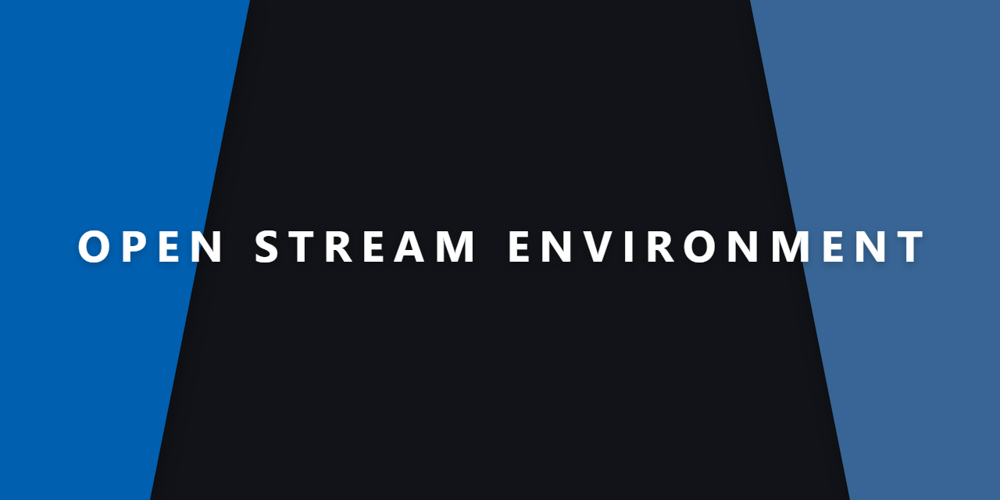
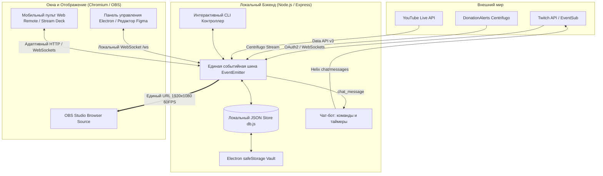

# Open Stream Environment

<p align="center">
  
</p>

Стрим-оверлей в стиле Material Design 3 + интуитивный визуальный редактор
(в стиле drag-and-drop, аналогично механикам Figma) — перетаскивание, ресайз,
добавление/удаление виджетов на лету, собранные на Electron. Оверлей отдаётся локальным сервером как обычная веб-страница —
её нужно добавить в OBS как Browser Source.

Текущая версия: **3.2.5**.

## Что внутри

- **Панель управления** (`control/`) — окно Electron с двумя экранами:
  - **Редактор** — канвас 16:9 с превью оверлея, библиотека виджетов слева,
    слои и свойства выбранного виджета справа. Виджеты перетаскиваются,
    ресайзятся за уголки, добавляются кликом/перетаскиванием из библиотеки,
    удаляются кнопкой корзины или клавишей Delete.
  - **Настройки** — подключение Twitch / DonationAlerts / YouTube / OBS
    WebSocket, Soundboard, Stream Deck, ссылка на оверлей, смена порта и
    сброс раскладки.
- **Оверлей** (`overlay/`) — страница, которую видит зритель: рендерит ту же
  раскладку виджетов с реальными данными (алерты, чат, цель доната,
  последние события).
- **Локальный сервер** (`server/`) — Express + WebSocket, общая шина между
  панелью управления, оверлеем и интеграциями (Twitch, DonationAlerts, YouTube, а также архитектурный задел под MemeAlerts).
  Раскладка оверлея хранится в локальном JSON-файле `config/local-db.json`,
  остальные настройки — в `config/config.json` (создаётся автоматически при
  первом запуске из `config/config.example.json`).
- **Локальная база данных** (`config/local-db.json`) — сохранение раскладки оверлея,
  настроек и сессий; история стрим-событий (донаты/подписки/фоллоу) лежит рядом
  в append-only `config/local-db.jsonl`, история чата — в `config/local-db.chat.jsonl`
  (JSON Lines), обе дописываются построчно.
- **Колесо Фортуны** — интерактивный псевдо-3D барабан (CSS 3D Transforms +
  Canvas) с адаптацией под системные темы оформления. Живёт только на своей
  OBS-сцене (`overlay/wheel-scene.html`) и больше не грузится в основной
  оверлей.
- **Розыгрыши среди зрителей чата** — сбор участников по команде, фильтрация
  дубликатов (`Set`), перемешивание Фишера-Йетса и режим на выбывание.
- **Голосование в чате** — отдельная полноэкранная сцена с живой диаграммой
  (столбики или круг); зрители голосуют командой (`!poll 1`, `!poll 2`, …),
  пункты, команда и тип диаграммы настраиваются в панели «Голосование» (кнопка
  в шапке), голоса обновляются в реальном времени. Пресеты сохраняют готовый
  набор голосования (команда, тип диаграммы и пункты) для быстрой загрузки.
- **Бот чата и автомодерация** — встроенный Nightbot-подобный бот: свои команды
  с переменными и уровнями доступа, таймеры, встроенная `!commands`, а также
  автомодерация — защита от ссылок (белый список доменов), чёрный список слов
  с делейтизацией, лимит капса и смайлов и система варнов (предупреждение →
  таймаут → бан). Всё настраивается в «Настройки → Бот чата».
- **Единый виджет алертов** — объединяет события Twitch, DonationAlerts и
  уведомления Колеса Фортуны в общую очередь; очередью (порядок, пауза, правила,
  пропущенные донаты) управляет сервер — см. «Очередь алертов».
- **Список участников розыгрыша на сцене колеса** — живой список зрителей
  с настройками (количество имён, шрифт, цвет, прозрачность, бегущая строка,
  позиция и размер) в панели «Колесо».
- **Таймер Executive Hangar** — цикл контестед-зоны из Star Citizen: Red (2 ч) →
  Green (1 ч) → Black (5 мин), пять огней-кружков (загораются каждые 24 мин,
  гаснут каждые 12 мин) и следом крупный остаток текущей фазы, строка «сброс
  цикла через …» (в блэкауте — «Red phase starts in …», как на сайте) и подсказка
  о следующей смене индикатора. Источник всегда **Longshot**: сервер раз в
  5 минут (и по кнопке «Обновить») запрашивает тот же живой конфиг, что и сайт
  (`api-longshot.longshotrelay.com/api/hangar-config`), и берёт оттуда анкер
  и длительности; при недоступности API есть фолбэк на статичный
  `timer-config.json`, а при полном сбое остаётся последний удачный анкер —
  виджет не гаснет и совпадает с сайтом. Заголовок фиксирован, в панели только
  переключатели отображения. Опрос ленивый: сервер ходит в API только пока в
  раскладке есть видимый таймер. Два варианта: 2D (`timer` — темы Orbital и
  свои) и 3D (`grimhex-timer` — 3D-набор Orbital/Star Citizen); при включении
  3D 2D-версия подменяется Grim HEX-версией.
- **Звуковое сопровождение розыгрыша** — музыка вращения барабана с затуханием,
  звуки победы/выбывания и настраиваемая громкость в панели управления.
- **Регулировка скорости Колеса Фортуны** — от «медленно» до «быстро» (1–5),
  сохраняется в локальной БД и влияет на число оборотов/длительность вращения.
- **Полная адаптивность (Responsive Design)** — панель управления и 3D-оверлеи
  автоматически масштабируются под любые разрешения экрана (от Full HD до
  2K/4K) без потери качества графики и читаемости текста.
- **Система тем оформления** — встроенные 2D-темы Material You, Orbital,
  Pixel Perfect и Elite, а также их 3D-варианты Star Citizen (Grim HEX),
  Nuclear и Cobra Mk II с неоновыми 3D-виджетами. Тема выбирается одной
  карточкой; тумблер «3D» включает её 3D-вариант.
- **Локализация (RU/EN)** — русский и английский интерфейс для панели
  управления, оверлея, сцен и Колеса Фортуны. Язык переключается в настройках,
  сохраняется в локальной БД и мгновенно применяется во всех открытых окнах.
- **Виджет «Визуализатор микрофона»** — живая звуковая волна с микрофона
  (Web Audio API + Canvas, до 30 FPS); в тишине превращается в плавную
  горизонтальную линию. Четыре режима: **плавная синусоида**, **частотные
  столбики**, **круговой визуализатор** и **классический эквалайзер**
  (LED-сегменты со спадом пиков). Панель свойств показывает только настройки
  выбранного режима: синусоида — чувствительность и толщина; столбики — число
  полос и зазор; кольцо — полосы и толщина; эквалайзер — полосы, зазор и спад
  пиков (цвет — фиксированная палитра). Спектр раскладывается по
  логарифмической (или линейной) шкале с усреднением бинов, сглаживанием
  (attack/release) и шумовым гейтом; есть усиление. Настройки отображения
  хранятся на самом виджете (несколько визуализаторов независимы), а захват —
  устройство ввода, эхоподавление, шумоподавление и AGC — глобально. Панель
  свойств показывает живой уровень сигнала и превью под каждый режим.
- **Встроенный терминал логов** — панель реального времени в панели управления
  (кнопка «Логи» в шапке): структурированные логи сервисов (Twitch,
  DonationAlerts, сервер) с подсветкой уровней и сервисов, автоскроллом,
  кнопкой очистки и лимитом 500 строк.
- **Панель DonationAlerts** — отдельная боковая панель (кнопка «DA» в шапке,
  полное имя — в подсказке) для управления сервисом в эфире: состояние подключения
  и здоровья токена, аккаунт, быстрые действия (переподключить, тестовый донат,
  подтянуть пропущенные, озвучка от сервиса), последние донаты с повтором алерта и
  живой журнал только этого сервиса. Вместе с ней открывается «Очередь алертов» —
  отдельной кнопки в шапке у очереди нет. Подробнее — в разделе «DonationAlerts».
- **Всплывающие уведомления** — в правом верхнем углу панели управления
  появляются карточки о новых событиях (фоллоу, подписка, гифт-подписка,
  чир, донат) и автоматически исчезают через несколько секунд. Если панель
  свёрнута в трей или не в фокусе, эти же события приходят нативными
  OS-уведомлениями. Ко всем уведомлениям можно включить звуковой сигнал
  и настроить его громкость (переключатель и слайдер в
  «Настройки → Приложение»).
- **Интеграция YouTube Live** — чат прямого эфира и события (Super Chat,
  Super Sticker, новые участники) через YouTube Data API v3.
- **Управление интеграциями** — переключатели включения/отключения Twitch,
  DonationAlerts и YouTube прямо в настройках.
- **Soundboard (Шумотека)** — запуск звуков и анимаций за баллы канала Twitch
  (channel points): маппинг наград на аудио/GIF с диска, громкость, режим
  очереди.
- **Озвучка донатов (TTS)** — текст доната из DonationAlerts зачитывается
  голосом прямо в оверлее (Web Speech API): вкл/выкл, громкость, скорость,
  язык и выбор голоса в Настройках → DonationAlerts, с кнопкой «Тест озвучки».
- **OBS WebSocket** — переключение сцен, кастомные RAW-команды, мультикамера
  (ракурсы за баллы) и «Эффекты/Фильтры камеры» (Ч/Б, размытие, пикселизация,
  хромакей по таймеру или тумблером).
- **Награды канала (действия)** — награда за баллы Twitch может запускать
  алерт, озвучку (TTS) и переключать сцену; в тексте работают плейсхолдеры
  `{user}`, `{reward}` и `{input}`. Настраивается в «Настройки → Награды канала»,
  тест — кнопкой «▶» или командой `sim points <название>` в терминале.
- **Клип и маркер стрима** — кнопки «Клип» и «Маркер» в шапке приложения
  создают клип и маркер на Twitch через Helix API (нужны права `clips:edit` и
  `channel:manage:broadcast`).
- **Плагин Elgato Stream Deck** — переключение сцен (старт/BRB/колесо/
  разговор/main/конец/голосование) с подсветкой активной сцены и своими иконками.
- **Сцена «Разговор» (Just Chatting)** — фон, крупный чат справа (слева место
  под вебку) и всплывающие алерты.
- **Заставки между сценами** — на сценах «Начало / BRB / Разговор / Окончание /
  Колесо / Голосование» задаётся видео/картинка/GIF, который проигрывается при
  переключении сцен; авто-переход по окончании видео или по таймеру (авто или
  1–30 сек). Каждую сцену можно включать/выключать переключателем. Настраивается
  в отдельной вкладке «Заставки».
- **Тест чата** — кнопка в шапке панели управления отправляет несколько
  тестовых сообщений для проверки чата и сцены Just Chatting.
- **Настройка порта** — порт локального сервера меняется на вкладке
  «Настройки → Приложение» и применяется сразу, без перезапуска приложения.
  Панель управления сама переподключается к новому порту; источник в OBS
  (Browser Source) нужно обновить на новый адрес вручную.
- **Автообновления (по кнопке)** — при старте приложение только проверяет
  наличие обновления (без скачивания) и, если оно есть, подсвечивает кнопку
  «Обновить» в шапке. Клик по ней открывает меню «Позже» / «Обновить»;
  «Обновить» скачивает и устанавливает новую версию. Также можно нажать
  «Проверить обновления» в «Настройки → Приложение».
- **Режим редактирования HUD** — прозрачный оверлей поверх игры (Borderless
  Window) для перетаскивания и ресайза виджетов прямо в игре; хоткей по
  умолчанию Control+Shift+H, выбор монитора в настройках.
- **Чат поверх игры** — прозрачное плавающее окно чата поверх игры (клики
  проходят насквозь) для одномониторных стримов; хоткей по умолчанию
  Control+Shift+L, настройки размера, позиции, прозрачности и шрифта.

Все виджеты можно класть на канвас в любом количестве и любом месте:
**Алерты**, **Цель доната**, **Чат Twitch**, **Последние события**, а также
**Свой виджет** (текст, картинка или произвольный HTML — см. ниже),
**Счётчик** (фолловеры/подписчики Twitch, топ донат сессии или донаты за
текущий стрим — числом и суммой),
**Соц. баннер** (по очереди показывает соцсети из списка), **Таймер
Executive Hangar** (цикл Executive Hangar; 2D- и 3D-варианты) и
**Визуализатор микрофона** (анимированная звуковая волна).

## Очередь алертов

Очередью алертов управляет сервер (`server/alert-queue.js`), а не страница
OBS. Раньше это было наоборот: алерты уходили в эфир сразу, а порядок и паузы
держал виджет внутри страницы. Из этого следовало, что панель не знает, что
происходит в эфире, перезагрузка страницы OBS молча выбрасывает непоказанное,
а повлиять на порядок нельзя.

Теперь сервер решает, что играет, и рассылает алерты по одному, выдерживая
паузу между ними (длительность алерта + хвост на анимацию ухода). Отсюда всё
остальное:

- **Панель «Очередь»** — открывается вместе с панелью «DA» и стоит слева от неё
  (своей кнопки в шапке у очереди нет): что в эфире, что ждёт, и
  кнопки — «Пропустить», «Пауза» (без срока и на 5/15/30 минут),
  «Продолжить», «Показать сейчас», «Выше», «Убрать», «Очистить очередь». Тот
  же блок есть на Web Remote: с телефона можно поставить алерты на паузу во
  время речи, не бегая к компьютеру. Там же — счёт донатов текущего стрима
  (сколько и на какую сумму): телефон лежит под рукой, а вопрос «сколько уже
  собралось» задаётся в эфире. Счёт можно сбросить кнопкой (тоже с телефона):
  он касается только цифры на экране — история донатов и цель сбора не трогаются.
- **Счёт на экране.** Чтобы видеть донаты за стрим в эфире, положите на канвас
  виджет «Счётчик» и выберите метрику «Донатов за стрим» или «Сумма донатов за
  стрим». HUD-окно рисует ту же композицию, что и оверлей, поэтому отдельной
  настройки для него не нужно.
- **Правила.** «Не показывать донаты меньше» (0 — показывать все) отсекает
  показ, но не сам донат: он всё равно попадает в историю и в цель сбора.
  «Объединять донаты одного зрителя» склеивает подряд идущие донаты одного ника
  в пределах окна в один алерт с общей суммой и счётчиком (`×N`).
- **Перезагрузка страницы OBS.** Страница — это просто окно вывода: очередь
  живёт на сервере, поэтому текущий алерт отправляется заново при подключении,
  а непоказанное не теряется.
- **Пауза переживает перезапуск.** Срок паузы лежит в `config.json`
  (`alert_queue.pause_until`), поэтому «пауза на 30 минут» не превращается в
  «пока приложение не перезапустят». Пауза без срока намеренно бессрочная
  только в пределах запуска: после перезапуска алерты снова показываются.
- **«Подтянуть пропущенные»** — разово спрашивает у DonationAlerts список
  донатов и показывает те, которых нет в истории (по id доната). Нужно право
  `oauth-donation-index` — см. раздел «DonationAlerts». Запрос идёт только по
  кнопке: у сервиса лимит 60 запросов в минуту, а живые донаты и так приходят
  сокетом.

Алерты Колеса Фортуны (`wheel_start`/`wheel_winner`) идут мимо очереди: их
показ привязан к сцене розыгрыша, которую приложение прячет по своему таймеру,
и задерживать карточку победителя за чужими алертами неправильно.

В `config.json` есть `alert_queue.enabled`: `false` возвращает прежнее
поведение — прямая рассылка без очереди (алерты уходят сразу, без правил,
объединения и паузы). Это запасной выход, если очередь мешает; переключатель для
него есть в самой панели «Очередь», и менять файл руками не нужно. Ожидающие при
выключении сбрасываются, а алерт, который уже в эфире, доигрывает и уходит
сам — переключение не выдёргивает картинку из-под зрителя.

## Оформление (темы)

На вкладке «Настройки» → «Оформление» каждая тема — это «семья»: базовая
2D-палитра и, у части тем, необязательный 3D-вариант, который включается
тумблером «3D» прямо на карточке темы.

Базовые темы задают палитру оверлея, сцен и Колеса Фортуны:

- **Material You** — фирменная синяя палитра приложения (Material 3),
  стеклянные полупрозрачные панели с блюром, бейдж-пилюля у лейбла алерта
  (по умолчанию). 3D-вариант — **Material You 3D**.
- **Orbital** — HUD-стиль в духе Star Citizen: строго прямые углы без
  скругления, 4 уголка-скобы на каждом углу панели, лёгкие сканлайны,
  фоновая сетка-текстура на сценах, циан/янтарь/красный акценты, шрифты
  Orbitron/Rajdhani. 3D-вариант — **Star Citizen**.
- **Pixel Perfect** — минималистичный тёмный интерфейс в пиксельном стиле:
  почти чёрные нейтральные поверхности, плоские 1px рамки и приглушённый
  золотой акцент; сжатый шрифт PT Sans Caption (текст и данные), чат — Roboto
  Condensed. 3D-вариант — **Pixel Perfect 3D**.
- **Elite** — оранжевый HUD в духе Elite Dangerous: прямые углы, лёгкие
  сканлайны и фирменный оранжевый акцент Faulcon DeLacy (`#ff7605`) с
  циановым/красным для акцентов. 3D-вариант — **Cobra Mk II**.
- **Nuclear** — холодный CRT-терминал: зелёный фосфор и сканлайны; 3D-вариант
  добавляет радиоактивные виджеты (знак радиации, чат, донат-цель, голо-алерт).

Шрифты тем едут внутри приложения: 11 семейств (Manrope, JetBrains Mono,
Orbitron, Rajdhani, PT Sans Caption, IBM Plex Mono, Cinzel, Montserrat, Roboto,
Roboto Condensed, Roboto Mono) с начертаниями 400 и 700 лежат в `assets/fonts/`
и подключаются через `shared/fonts.css`, поэтому тема выглядит одинаково на
любой машине, даже если нужного шрифта в системе нет. Рядом с файлами — текст
лицензии. Кириллицы нет у Orbitron, Rajdhani и Cinzel — это особенность самих
шрифтов: русский текст в этих темах берёт системный шрифт.

Тумблер «3D» включает неоновые 3D-виджеты поверх той же палитры:

- **Material You 3D** — мягкая 3D-сфера с орбитой, чат на приподнятой
  карточке, градиентная донат-цель и всплывающий алерт с вращающимся значком.
- **Pixel Perfect 3D** — прозрачный каркасный изометрический пиксель-куб,
  скрытый до первого алерта: на всех его гранях отображается иконка активного
  алерта (вращается вместе с кубом), пиксельный чат, блочная шкала донат-цели
  и пиксельный алерт.
- **Star Citizen (Grim HEX)** — 3D-вариант Orbital: вывеска Grim HEX,
  вывеска Café Musain, чат, донат-цель и голографический терминал.
- **Cobra Mk II** — 3D-вариант Elite: голограмма корабля, вывеска Elite
  (неоновая эмблема Elite Dangerous), чат, донат-цель, голо-алерт, щит-цель
  с кольцами и перспективный радар, где донатеры появляются как корабли на
  сенсоре.
- **Nuclear** — 3D-виджеты: знак радиации, чат, донат-цель и голо-алерт.

Когда 3D включён, его виджеты появляются поверх базового оверлея, а
соответствующие 2D-виджеты (чат, цель, алерты) автоматически заменяются
3D-версиями, сохраняя позицию и размер; при выключении 3D они возвращаются к
2D-виду. Явно расставленный 3D-чат/цель/алерт следует за сменой темы — один и
тот же виджет превращается в аналог новой темы (Material You → Star Citizen →
Pixel Perfect → ...). Декоративные 3D-виджеты (вывески, радар, щит, сфера, куб)
тоже следуют за темой: вывеска заменяется вывеской, радар — радаром; если у
активной темы нет аналога, виджет скрывается на оверлее и не отображается на
канвасе редактора (в списке слоёв остаётся с пометкой «выкл»). У активной
3D-темы внизу появляется список «3D-виджеты» —
каждый из них можно включить или выключить отдельным тумблером (например,
оставить только сферу и цель, без чата). Канвас редактора, список слоёв и
панель свойств показывают виджеты уже в эффективном виде текущей темы. Тема
влияет только на сам оверлей и его превью на канвасе — панель управления
(топбар, библиотека, настройки) всегда выглядит одинаково.

Кнопки «Создать свою тему» и «Изменить» открывают полноценный редактор темы в
отдельном окне. Оно оформлено палитрой самого приложения и повторяет его
компоновку: фон и поверхности — из `shared/theme.css` как есть
(`--md-surface-dim` для страницы, `--md-surface-container-*` для карточек и
правой панели), акценты — родные `#c6b8ff` / `#7ee0d6` / `#ffb0d8` с on-цветами,
без производных тонов. Шапка — как `.topbar` (бренд-марка, пилюли-табы,
кнопки-иконки отмены/повтора/экспорта и чип «Сохранено / Не сохранено» в одной
строке), колонка — как экран «Настройки» (стек карточек, центрированная колонка),
правая панель — как `.inspector` (272px, капс-заголовки).
Форма разбита на вкладки (Палитра,
Фон и панели, Форма, Шрифты, Анимация, 3D-виджеты, Свой CSS), а справа
постоянно живёт рейл с живым превью, проверкой контраста и инспектором токенов —
«Превью в окне» и «Сэмплы» нужны уже только для проверки на настоящем оверлее.

Помимо 4 цветов-затравок (основной, второй, третий, фон — остальная палитра
контейнеров и `on-*` цветов считается автоматически) есть инструменты палитры:
галерея готовых наборов (в том числе по мотивам встроенных тем), вывод
производных цветов из основного (аналоговая, комплементарная, триада,
раздельно-комплементарная, монохром), случайная палитра, пипетка (взять цвет с
экрана), hex-поля рядом с каждым пикером и история недавних цветов. Схема темы
переключается между тёмной и светлой («Схема» в разделе «Палитра»): светлая
разворачивает всю палитру по светлой шкале поверхностей и делает тени мягче, а
в галерее есть готовые светлые пресеты «Daylight» и «Paper». Гранулярные
настройки: семь форм панелей (скруглённая, угловатая/HUD, острая, мягкая,
капсула, скобки по четырём углам, Hazard), гарнитуры отдельно для заголовков /
основного текста / данных (таймеры, суммы), толщина/стиль/цвет рамки, свечение
(цвет + интенсивность), цвет фона и текста, прозрачность панелей и размытие фона,
цвет ошибки и анимация появления алертов (длительность и кривая). Контролы на
«Авто» показывают, какое значение унаследовано от формы панели, и блокируются —
вместо молчаливо неработающего слайдера.

Черновик сразу проверяется на читаемость: блок «Контраст (WCAG)» считает
отношение текста, второстепенного текста, акцента и ошибки к фону и умеет
подобрать безопасный тон одним нажатием. Инспектор токенов показывает итоговые
`--md-*`/`--panel-*` значения, которые получает оверлей (клик — копировать
`var(--…)`). Любое изменение отменяется и повторяется (Ctrl+Z / Ctrl+Shift+Z,
кнопки ↶ ↷), в шапке видно статус несохранённых изменений, Ctrl+S сохраняет,
Esc и крестик окна спрашивают подтверждение, так что правки не теряются молча.
Для продвинутых есть CSS-редактор в духе Notepad++
(подсветка синтаксиса, автодополнение свойств/значений/`var(--…)`/селекторов,
проверка синтаксиса, поиск/замена, отмена/повтор и строка состояния) — но теперь
он встроенный: кнопка «Редактировать CSS» разворачивает его на месте колонки
формы (правый рейл с превью, контрастом и токенами остаётся на виду), «Готово»
или Esc возвращают форму, а набранное пишется в тему на лету. CSS подгружается
как `<style id="ose-custom-theme-css">` в оверлей и канвас — а
подсказка `var(--…)` берёт токены именно текущей темы. Тему можно
продублировать, сбросить раздел формы к авто, а также экспортировать (кнопка ⤓
в шапке редактора и на карточке темы) и импортировать в отдельный JSON-файл.

У своей темы — **список всех 3D-виджетов с тумблерами**: отметьте любые
(стили можно смешивать). Тумблер «3D» на карточке включает выбранное;
панельные 3D-виджеты (чат, цель, алерты) берут вашу палитру, а декоративные
вывески/радар/щит сохраняют фирменные цвета (в отличие от встроенных тем, где
3D-вариант полностью перекрывает токены). Если у роли (чат/цель/алерты) отмечен
ровно один виджет, обычный 2D-виджет заменяется им автоматически.

## Локализация

Интерфейс переведён на русский и английский. Язык переключается кнопками
RU/EN в шапке панели управления и сохраняется в локальной БД
(`local-db.json` → `language`), поэтому выбор переживает перезапуск
приложения. Изменение мгновенно уходит во все окна: панель управления,
оверлей, сцены и Колесо Фортуны.

Переводы лежат в `shared/locales/ru.json` и `en.json` (плоские пути через
точку, например `giveaway.start`, с подстановкой `{{name}}`). Хелпер
`shared/i18n.js` предоставляет `I18n.t('ключ', { ... })`, а статичные
подписи в HTML переводятся атрибутами `data-i18n` / `data-i18n-placeholder` /
`data-i18n-title`. Чтобы добавить язык — создайте ещё один JSON в
`shared/locales/`, подключите его в `server/index.js` (`LOCALES`) и добавьте
кнопку в переключатель.

## Сетка и соотношение сторон

В тулбаре под канвасом есть селектор «Сетка»: Выкл / 2% / 5% / 10% —
включает видимую сетку и прилипание при перетаскивании/ресайзе виджетов к
этому шагу (в процентах канваса).

Рядом — селектор «Соотношение»: задаёт пропорции канваса редактора
(16:9, 16:10, 21:9, 32:9, 4:3, 1:1, 9:16, 3:4). Раскладка хранится в
процентах, поэтому при смене пропорций виджеты сохраняют позицию; сам
оверлей всегда занимает весь источник OBS (100vw/100vh), так что для
вертикальных (9:16) или ультрашироких (21:9) стримов достаточно выбрать
соответствующее соотношение канваса и задать его же в OBS Browser Source.

## Пресеты раскладки

В тулбаре под канвасом есть блок «Пресеты»: текущее расположение виджетов
можно сохранить под именем, а затем загрузить или удалить из выпадающего
списка. Кнопка «Сохранить» перезаписывает выбранный в списке пресет; если
ничего не выбрано — создаёт новый по введённому имени. Вместе с раскладкой
пресет сохраняет активные 2D/3D-темы, поэтому при загрузке 3D-пресета его
Star Citizen-виджеты сразу становятся видимыми. Пресеты хранятся в
`config/local-db.json` и не затрагивают остальные настройки.

## Экспорт / импорт настроек

На вкладке «Настройки» внизу — «Экспорт / импорт настроек»: экспорт
сохраняет копию `config.json` (раскладка, темы, цель, токены Twitch/
DonationAlerts) в выбранный файл через системный диалог; импорт читает такой
файл, полностью заменяет текущие настройки и на лету переподключает
интеграции. Файл экспорта содержит секреты — не выкладывайте его публично.

## История и данные

Кнопка «История» в топбаре открывает окно с тремя вкладками:

- **События** — донаты, подписки, фоллоу и чиры: поиск, фильтр по типу и кнопка
  «Повторить», которая заново проигрывает алерт в оверлее. Текущую выборку
  можно экспортировать в CSV/JSON или удалить по фильтру (не только всю
  историю целиком).
- **Сессии** — список стримов с началом, каналом, длительностью и числом
  событий/донатов/сообщений чата за сессию.
- **Чат** — сохранённые сообщения чата с поиском и постраничной подгрузкой.

В «Настройки → Данные и хранилище» видно путь к папке данных, размеры базы и
историй, число сессий; там же задаётся лимит истории событий, включается/выключается
запись истории чата, очищаются данные по области (события / сессии / чат / всё) и
открывается папка с файлами. Кнопка «Сбросить базу данных» удаляет раскладку,
пресеты, сессии и всю историю и перезапускает приложение.

В открытой панели «История» клавиши `1`, `2`, `3` переключают вкладки, а `Esc`
закрывает панель. Те же клавиши работают и в других панелях для закрытия по `Esc`.

### Целостность файлов и восстановление

`config.json` и `local-db.json` — единственное место, где живут настройки, поэтому
с ними обращаются осторожно:

- Каждая запись атомарна (через временный файл с переименованием), рядом
  периодически остаётся бэкап последнего удачного состояния: `config.json.bak.0`,
  `.bak.1`, `.bak.2` (свежий — с индексом 0, не чаще раза в 5 минут).
- В «Настройки → Данные и хранилище» есть список копий с датой и размером и
  кнопкой «Восстановить» — на случай, когда файл цел, но испорчен руками («сломал
  раскладку вчера вечером»). Битые копии помечены и недоступны. Настройки и база
  откатываются отдельно; история событий и чата откату не подлежит — она живёт в
  append-only файлах и в копии не входит.
- Если файл окажется повреждён (обрыв записи, сбой диска, правка руками), он **не
  удаляется и не затирается**: он уезжает рядом в карантин
  `<файл>.corrupt-<дата-время>`, а состояние поднимается из последнего целого
  бэкапа. Если бэкапа нет — `config.json` собирается из шаблона поставки, а в БД
  берутся значения по умолчанию.
- Что именно произошло, видно при запуске: диалог со списком восстановленных
  файлов, запись в `logs/recovery-<дата>.log` и строка в консоли.
- Фатальные ошибки главного процесса также не исчезают молча: перед выходом
  состояние сбрасывается на диск, пишется отчёт `logs/crash-<дата>.log`
  (платформа, версии Node/Electron, стек) и показывается диалог с путём к отчёту.
  Непойманные обещания логируются, но не прерывают эфир: их источник почти
  всегда сеть. Для отладки есть `OSE_STRICT_REJECTIONS=1` (считать реджект
  фатальным) и `OSE_KEEP_RUNNING_ON_UNCAUGHT=1` (не выходить после непойманной
  ошибки, а только записать отчёт).

Всё это лежит в каталоге данных (тот же, что открывается кнопкой «Открыть папку»
в «Настройки → Данные и хранилище»), так что бэкапы и карантин можно забрать оттуда
руками.

### Диагностика и отчёт для поддержки

Когда что-то «работает не так», есть два способа посмотреть на приложение
изнутри:

- **`GET /healthz`** на порту приложения — короткий JSON: жив ли сервер,
  сколько клиентов WebSocket по ролям, статусы Twitch/OBS/YouTube/DonationAlerts,
  размеры и счётчики хранилища, телеметрия записи, лаг event loop, сводка долгого
  прогона (память, переподключения) и список проблем (`problems`). Ни путей, ни
  секретов там нет — это же и удобный эндпоинт для мониторинга.
- **Кнопка «Сохранить отчёт»** в «Настройки → Данные и хранилище» — полный
  отчёт файлом: окружение (версии Node/Electron, платформа, память), состояние
  из /healthz, телеметрия записи, следы восстановлений и карантина, список файлов
  данных, отчёты о падениях, сводка настроек и хвост сегодняшнего лога. Тот же
  отчёт можно забрать по `GET /support-bundle`, но только с этой машины.

Для долгих эфиров рядом работает отдельный след: раз в 10 минут записывается
образец (память, клиенты оверлея, число переподключений интеграций, пик лага
event loop). `[longrun]` попадает в лог только когда есть на что смотреть —
заметный рост памяти или всплеск переподключений, а по запросу (`/healthz`,
отчёт для поддержки) отдаётся вся четырёхчасовая история: по ней видно,
«течёт» приложение за эфир или нет, и сколько раз ночью отваливался чат.

Секретов в отчёте нет: настройки собираются по явному списку полей (вместо
значений видно только «поле заполнено»), а готовый текст дополнительно
прогоняется через маскировку — `enc:…`, `?token=…`, `Bearer …` и домашний
каталог в него не попадают. Файл можно отправлять как есть.

## Свой виджет

В библиотеке виджетов есть «Свой виджет» — у него четыре режима (переключаются
в панели свойств справа):

- **Текст** — заголовок + текст, выравнивание, размер, опциональный фон-карточка.
- **Изображение** — URL картинки + вписывание (contain/cover).
- **Свой HTML** — кнопка «Редактировать код» открывает отдельное окно с
  вкладками HTML / CSS / JS и живым превью. JS выполняется по-настоящему
  (виджет рендерится через `<iframe>` с полноценным HTML-документом, а не
  просто вставкой в страницу) — можно использовать таймеры, анимации,
  запросы и любой код. Это локальное приложение только для вас, так что
  ограничений на содержимое нет — как в Browser Source самого OBS.
- **Встраивание (iframe)** — ссылка на внешний браузер-источник (например,
  виджет ЯП! от DonationAlerts), который встраивается как есть.

## Окно чата

Кнопка «Чат» в топбаре панели управления открывает отдельное окно с
лентой сообщений Twitch-чата — удобно держать сбоку экрана и следить за
чатом во время стрима, не переключаясь в браузер. Сообщения можно не только
читать, но и отправлять: внизу есть поле ввода с кнопкой «Отправить».
Публикация идёт через Twitch Helix от имени стримера, поэтому для отправки
нужно один раз подключить Twitch (см. раздел «Twitch» ниже). Историю не
хранит — показывает сообщения, пришедшие пока окно открыто.

Отдельно есть режим **«Чат поверх игры»** (Настройки → Чат поверх игры или
глобальный хоткей по умолчанию Control+Shift+L): прозрачное плавающее окно
поверх игры, которое всегда поверх остальных окон и пропускает клики
насквозь — полезно на одном мониторе. В настройках задаются монитор, размер
и положение окна, прозрачность фона и размер шрифта. Это окно только для
чтения — поле отправки в нём скрыто.

## Web Remote / OBS

В шапке панели управления показывается адрес мобильного пульта
(`http://<IP_ПК>:8710/remote`). Открыв его на телефоне в той же Wi-Fi сети,
можно управлять оверлеем: переключать сцены (старт/BRB/разговор/конец/колесо),
запускать Колесо Фортуны (включая генерацию секторов), менять счётчик смертей,
запускать тестовые алерты, менять тему, создавать клип и маркер стрима, а
также переключать ракурсы камеры и включать эффекты/фильтры. Пульт состоит из
трёх вкладок: «Управление»
(быстрые действия), «Колесо» (настройки розыгрыша) и «Чат» — живая лента
сообщений стрима (Twitch/YouTube) с автоскроллом, подсветкой ника/бейджей и
полем ввода для отправки сообщений в чат Twitch.

Для переключения сцен в OBS включи `OBS WebSocket` (OBS 28+:
`Tools → WebSocket Server Settings → Enable WebSocket Server`) и заполни
карточку «OBS WebSocket» в настройках: host/порт/пароль, маппинг имён сцен
(логическое имя пульта → имя сцены в OBS), ракурсы камеры и эффекты/фильтры.

## Стек и системные требования

- Node.js 22.12+ и Electron 43.
- Локальное хранилище данных — JSON-файл `config/local-db.json` для
  раскладки и настроек; история событий — в append-only `config/local-db.jsonl`;
  `config/config.json` — для остальных настроек.
- Для псевдо-3D компонентов оверлея (Колесо Фортуны) используется аппаратное
  GPU-ускорение через CSS 3D Transforms поверх HTML5 Canvas.

## 📐 Архитектурные принципы и оптимизация

- **Zero-CPU Idle & Рендер-стратегия:** Проект спроектирован с разделением на пассивный 2D-слой (Material Design 3) и тяжелый 3D-слой телеметрии. Трехмерные виджеты (радары, голограммы) используют процедурный цикл `requestAnimationFrame` с жестким ограничением FPS (функциональные анимации — 30 FPS, декоративные панели с «дыханием»/фликером — 20 FPS), который автоматически засыпает (`setIdle(true)`), если на экране нет анимаций или виджет скрыт. Это гарантирует 0% нагрузки на GPU/CPU стримера вхолостую. Визуализатор микрофона идёт по тому же принципу: собственный rAF-цикл ограничен 30 FPS (совпадает с частотой микрокадров) и пропускает отрисовку, когда виджет скрыт. Дополнительно любой анимированный виджет (3D и микровизатор) ставится на паузу, когда скрыта сама страница/окно (`document.hidden`) — скрытый HUD-оверлей не крутит цикл вхолостую.
- **Детерминированная симуляция физики:** Анимации элементов (например, дрейф кораблей на радаре Grim HEX или вращение Колеса Фортуны) используют временные снимки начального состояния (`performance.now()`). Расчет координат идет от дельты времени, что предотвращает лаги, телепортации или рассинхроны графики оверлея даже при просадках FPS в тяжелых играх.
- **Изолированный «Песочный» запуск (Sandbox iFrames):** Компонент «Свой виджет» рендерится внутри изолированного `<iframe>` с полноценным HTML-документом. Кастомный пользовательский JS-код выполняется в собственной изолированной среде, благодаря чему ошибки в скриптах пользователя физически не могут уронить основную WebSocket-шину или сломать рендеринг системных алертов.
- **Локальный аудио-мост (Mic Bridge):** Для обхода политик безопасности OBS Browser Source (который блокирует захват аудио без HTTPS) микрофон захватывает панель управления через `getUserMedia` (Electron выдаёт доступ), ужимает волну и спектр до 240 + 128 байт и шлёт их бинарными кадрами (371 Б) — без JSON. Локальный сервер пересылает кадр как есть, не разбирая его, а оверлей декодирует zero-copy. Отправка идёт ~30 Гц, отрисовка визуализатора — в `requestAnimationFrame`. Микрокадры адресно уходят только клиентам с ролью `overlay` (роль — в query при подключении к `/ws`), а не всем окнам подряд.
- **Криптографическая защита секретов (Secret Vault):** Все конфиденциальные данные стримера (токены авторизации Twitch, YouTube, DonationAlerts, пароли OBS WebSocket) шифруются на лету алгоритмами AES-256 через нативный Electron `safeStorage` (используя DPAPI в Windows / Keychain в macOS / libsecret в Linux). Ключи никогда не хранятся и не передаются в открытом виде.
- **Атомарная и неблокирующая запись состояния:** `config.json` и `local-db.json` пишутся через временный файл с переименованием (атомарно, без обнуления при краше), при этом асинхронно и с коалесингом — частые сохранения не блокируют event loop и не копят очередь; при выходе выполняется финальный синхронный сброс. Растущая история событий вынесена в отдельный append-only `local-db.jsonl`: в памяти держится только лёгкий индекс (смещение/время/тип), а содержимое читается по требованию; индекс строится лениво, поэтому 20 000 событий стоят ~3 МБ вместо ~20 и не читаются на старте.
- **Защита от порчи уже записанного:** атомарная запись спасает от сбоя во время записи, но не от порчи готового файла, поэтому рядом со снапшотом ведутся `.bak.0…2`, а при чтении битый файл уходит в карантин и состояние поднимается из бэкапа (а если испортил руками — есть ручной откат к копии из настроек; см. «Целостность файлов и восстановление»). Ошибки процесса не остаются загадкой: непойманные исключения пишут отчёт на диск, сбрасывают состояние и показывают диалог (`server/crash-guard.js`), а непойманные обещания (почти всегда — сетевые обрывы) логируются, но не прерывают эфир.
- **Гейты поставки в тестах:** сборка чинится не после жалобы пользователя, а тестом — проверяются цели `loadFile`/`loadURL` и покрытие `build.files`, исключение данных/бэкапов/логов из дистрибутива, паритет словарей ru/en и совпадение версии CHANGELOG с `package.json`.
- **Наблюдаемость вместо догадок:** «почему отстал оверлей», «где мои настройки» и «не течёт ли память за эфир» решаются данными — телеметрия записи (`[atomic-write]`) и лаг event loop (`[perf]`) пишут строку только когда что-то реально происходило, след долгого прогона (`[longrun]`) хранит четыре часа образцов, отчёты о падениях и журнал восстановлений остаются на диске, `GET /healthz` отдаёт состояние машиночитаемо, а кнопка «Сохранить отчёт» собирает всё это в один файл без секретов для отправки в поддержку.



## Доступ из сети

Панель, оверлей в OBS, HUD и редакторы подключаются с этой же машины и не
спрашивают ничего. Всё, что приходит из локальной сети, обязано предъявить код
доступа: порт слушает все интерфейсы, и без такой проверки переключать сцены
мог бы любой в той же Wi-Fi-сети.

- Код создаётся при первом запуске (32 символа), лежит в `config.json` и входит
  в адрес пульта: `http://<ip>:<порт>/remote?token=<код>`. Тот же код пульта
  отправляет в строке подключения к шине — Web Remote работает как раньше, если
  открывать адрес из шапки приложения (кнопка копирования — там же).
- «Настройки → Доступ из сети» — адрес пульта и кнопка «Новый код доступа»: старый
  код сразу перестаёт работать, подключённые из сети устройства отключаются,
  адрес на телефоне нужно открыть заново. Нужно, если адрес ушёл не туда —
  скриншот, чат, гость.
- Сторонние скрипты могут передавать код заголовком `x-ose-token`.
- Полный отчёт `/support-bundle` доступен только локальным запросам, а `/healthz`
  открыт всем, кто достучался до порта: в нём нет ни путей, ни секретов — он для
  мониторинга.
- Статика (страница пульта, ассеты, пользовательские медиа) отдаётся без кода:
  её можно только читать. Код защищает управление — команды на шине.

Рядом — журнал команд и ограничитель частоты: каждая команда клиента оставляет
след (время, роль, «из сети», безопасные детали), лишние сверх 60 в секунду
отбрасываются. Полный payload в журнал не пишется, а в отчёт для поддержки
попадают последние 50 записей — по ним видно, что происходило в эфире и не
стучался ли кто-то в шину.

## Установка и запуск

Нужен Node.js 22.12+. Установка зависимостей:

```bash
npm install
npm start
```

При запуске сначала на пару секунд появится сплеш-скрин, потом откроется
окно панели управления. Оверлей для OBS в это время уже доступен по
адресу, который показан внизу канваса и на вкладке «Настройки» — по умолчанию:

```
http://localhost:8710/overlay/overlay.html
```

Добавьте его в OBS: **Источники → + → Browser Source**, вставьте URL,
разрешение 1920×1080, FPS источника 30. Прозрачность работает из коробки —
фон оверлея прозрачный. Подробнее про лимиты — в разделе
«Производительность и лимиты для OBS».

Можно также поднять только сервер без Electron-окна (удобно для отладки
самого оверлея в обычной вкладке браузера):

```bash
npm run server:only
```

## Производительность и лимиты для OBS

Оверлей — обычная веб-страница, поэтому основную нагрузку даёт отрисовка в
Browser Source, а не бэкенд (он тратит доли процента). Практические ориентиры:

**Источник в OBS**
- **FPS источника — 30.** Виджеты всё равно анимируются не чаще: 3D — 20–30 FPS,
  микровизатор — 30. Значение 60 не добавит плавности, но удвоит работу.
- **Обязательно включите «Завершать работу источника, когда он не отображается»**
  (Shutdown source when not visible). Без этой галочки Chromium внутри OBS
  может не выставить `document.hidden` для неактивной сцены, и пауза rAF-циклов
  3D-виджетов (энергосбережение) не сработает — скрытая сцена продолжит
  рендериться. С ней скрытые сцены полностью засыпают.
- **«Обновлять браузер, когда сцена становится активной»** лучше держать
  выключенным: перезагрузка сбрасывает анимации, а фоновые страницы и так
  спят (см. `document.hidden` в архитектуре ниже).
- Разрешение — 1920×1080 (на 4K стоимость заливки растёт примерно вчетверо).
- Сцены — отдельные страницы и отдельные источники: держите активными только
  нужные.

**Виджеты на сцене**
- Тяжёлые — только анимированные 3D (радар, голограмма, знак/вывеска, щит,
  орб/куб): у каждого свой canvas-цикл. Комфортно — **2–3 таких виджета**
  одновременно и без растягивания на весь экран: стоимость ∝ площадь × FPS.
  В редакторе под канвасом есть счётчик **«3D-анимация: N · X% экрана»** —
  он считает именно такие виджеты и подсвечивается при превышении ориентира.
- 2D-виджеты (чат, цель, последние события, счётчик, соцбаннер, участники)
  дёшевы — их количество почти не влияет.
- Чат: у 2D-виджета `maxMessages` по умолчанию 8; у HUD-чатов 3D-тем жёсткий
  лимит 50 строк — на хайпе уменьшайте окно чата.
- Микровизатор держите один: захват микрофона (30 Гц) идёт, только пока этот
  виджет есть на сцене, и останавливается при его удалении.
- «Свой виджет» с произвольным JS/CSS может оказаться самым дорогим — следите
  за таймерами и анимациями в своём коде.

**Как измерить**
- OBS: `Вид → Статистика` (View → Stats) — пропущенные кадры и нагрузка рендера.
- Диспетчер задач / системный монитор → GPU/CPU. Если загружен GPU — уменьшайте
  число и площадь 3D-виджетов, а не ищите проблему в бэкенде.

## Тестирование

Тесты написаны на Jest и лежат в `tests/`. Запуск:

```bash
npm test
```

Статический анализ и форматирование:

```bash
npm run lint      # ESLint (ошибки и предупреждения)
npm run lint:fix  # ESLint с автоисправлениями
npm run format    # Prettier по всему проекту
```

CI прогоняет `npm run lint` и `npm test` на каждый push и pull request
(см. `.github/workflows/ci.yml`).

Среди наборов есть три, которые проверяют не модули, а систему целиком:
`e2e-scenarios` поднимает настоящий сервер и подключается к нему живыми
WebSocket-клиентами в ролях панели, оверлея и чата (команда → рассылка → файл на
диске, сессия стрима, микрокадры, порядок и паузы очереди алертов,
переподключение), `alert-recover` проверяет на том же живом сервере подтягивание
пропущенных донатов (сеть и DonationAlerts подменены заглушками), а `budgets`
держит заборы по размерам, времени записи и времени ответа — чтобы регрессия на
порядок ловилась автоматически, а не на стриме. Общие инструменты для них — в
`tests/helpers/`.

Покрытие (69 наборов, 629 тестов):

- `db`, `db-persist`, `history-store`, `atomic-write`, `atomic-backup`,
  `data-integrity`, `backups-restore` — хранилище: коллекции, история
  донатов/чата, лимиты, атомарная запись, бэкапы снапшотов, карантин и
  восстановление (и автоматическое, и ручное из настроек);
- `secret-store`, `state` — конфиг OBS/ракурсы/фильтры/Soundboard/Stream Deck,
  порт, победитель и секреты: зашифрованное значение не выдаётся наружу как
  секрет, причины «не удалось расшифровать» и «хранилище недоступно» различимы,
  пустой секрет не стирает сохранённый;
- `giveaway`, `scene-timer`, `cli` — розыгрыш, таймеры сцен, консольные команды;
- `donationalerts`, `donationalerts-rest`, `donationalerts-journal`,
  `obs-websocket`, `token-refresh`, `longshot-sync` — интеграции и их протоколы:
  живые донаты через Centrifugo, разбор REST-списка донатов (даты, нормализация
  строк, коды 401/403 как «не выдан нужный scope», лимиты), а также разделение
  журнала сервиса и панели «Отладка» (шаги протокола не вытесняют из панели
  события сервиса);
- `chat-bot`, `chat-moderation`, `camera-angles`, `camera-filters` — чат-бот,
  автомодерация и матчинг наград Twitch;
- `i18n`, `events`, `logger`, `storage-paths`, `media`, `export-events`,
  `mic-frame`, `mic-dsp`, `hangar-cycle`, `server-utils` — утилиты;
- `css-editor-core`, `theme-engine`, `widget-catalog`, `widget-engine` —
  редактор CSS, движок тем и каталог виджетов;
- `*-widget`, `overlay-widgets`, `pixel-widget` — рендер и состояние виджетов
  (в том числе метрики «Счётчика», включая донаты за стрим);
- `crash-guard` — обработчики фатальных ошибок процесса;
- `e2e-scenarios` — сквозные цепочки на живых WebSocket-клиентах (команда
  панели → оверлей → диск, сессия стрима, чат, повтор событий, микрокадры,
  порядок и паузы очереди алертов, выключение очереди и возврат к прямой
  рассылке, счёт донатов стрима и выборка донатов за текущую сессию);
- `alert-queue` — очередь алертов как чистая логика (порядок, ритм, правила,
  объединение, пропуск/подъём/снятие, пауза со сроком и её восстановление,
  снимок для UI);
- `alert-recover` — DonationAlerts на живом сервере: подтягивание пропущенных
  донатов, снимок состояния авторизации не выдаёт токены, переподключение
  перезапускает интеграцию (старый сокет закрывается), неизвестный сервис не
  роняет шину;
- `budgets` — бюджеты производительности: размер снапшота и файлов, время
  записи, старт, пачка команд, выборка истории, вещание нескольким клиентам;
- `access-control`, `audit-log`, `remote-access` — правила доступа из сети
  (локальные клиенты без кода, сетевые с кодом), ограничитель частоты команд,
  журнал команд и жизненный цикл кода доступа;
- `health`, `support-bundle`, `server-diagnostics`, `longrun-monitor` — отчёт о
  состоянии, отчёт для поддержки (включая проверку, что секреты в него не
  попадают), живые HTTP-эндпоинты `/healthz` и `/support-bundle` и наблюдение за
  долгим прогоном;
- `packaging`, `ci-config`, `locales`, `changelog` — гейты поставки и релиза:
  цели окон и `build.files`, ссылки страниц на ассеты, паритет словарей ru/en,
  версия CHANGELOG против `package.json`, шаги и версии в файлах CI;
- `deprecation-filter` — глушится ровно один устаревший код (DEP0040 — встроенный
  `punycode`), а остальные предупреждения доходят; проверяется и в отдельном
  процессе — по отсутствию строки в stderr;

## Twitch

**Чат** подключается сразу и анонимно — никаких токенов не нужно, только имя
канала (по умолчанию `halantar`), которое можно поменять на вкладке
«Настройки». Чтение сообщений работает без авторизации; отправка сообщений
из окна чата и Web Remote выполняется от имени подключённого аккаунта
стримера и требует авторизации ниже.

**Алерты о фоллоу/сабах/чирах** требуют зарегистрированное приложение и
авторизацию:

1. Зайдите на https://dev.twitch.tv/console/apps → «Register Your
   Application» (кнопка есть прямо в Настройках приложения).
2. Redirect URI укажите ровно тот, что показан в Настройках напротив поля
   Twitch (по умолчанию `http://localhost:8710/oauth/twitch/callback`).
3. Скопируйте Client ID и создайте Client Secret, вставьте их в Настройках.
4. Нажмите «Подключить Twitch» — откроется браузер с авторизацией Twitch,
   после подтверждения вкладку можно закрыть, приложение подхватит токен
   само.

Используются права `moderator:read:followers`, `channel:read:subscriptions`,
`bits:read`, для Soundboard и эффектов/ракурсов за баллы —
`channel:read:redemptions`, для отправки сообщений в чат из окна чата и
Web Remote — `user:write:chat`, а для автомодерации бота (таймауты/баны) —
`moderator:manage:banned_users`. Для клипов и маркеров стрима используются
`clips:edit` и `channel:manage:broadcast`, а для управления наградами —
`channel:manage:redemptions`. После добавления новых прав нужно нажать
«Подключить Twitch» повторно, чтобы перевыпустить токен.

## Бот чата и модерация

На вкладке «Настройки → Бот чата» включается встроенный чат-бот (Nightbot-стиль):

- **Команды** — имя, ответ-шаблон, уровень доступа (все / сабы / моды / стример),
  глобальный кулдаун и кулдаун на пользователя. В ответе можно использовать
  переменные `$(user)`, `$(channel)`, `$(args)`, `$(count)` и `$(random a|b|c)`.
- **Встроенная `!commands`** — показывает зрителю список доступных ему команд.
- **Таймеры** — периодические сообщения с интервалом и минимальной активностью
  чата между отправками.

**Автомодерация** (в том же блоке) включает:

- защиту от ссылок с белым списком доменов (по умолчанию `youtube.com`,
  `youtu.be`, `clips.twitch.tv`, `twitch.tv`, `boosty.to`);
- чёрный список запрещённых слов с делейтизацией (похожие латинские/цифровые
  символы приводятся к кириллице перед проверкой);
- лимит капса (доля заглавных букв) и максимальное число смайлов в сообщении;
- систему накопительных предупреждений: первое нарушение очищает сообщение и
  выдаёт предупреждение, второе — таймаут, третье — перманентный бан.

Модераторы, стример и VIP пропускаются до запуска проверок. Нормализованные
формы запрещённых слов считаются один раз при создании движка, а чистая по тексту
часть вердикта (ссылка/мат/капс) кэшируется небольшим FIFO-кэшем — на хайпе,
когда чат повторяет одни и те же строки, проверка почти бесплатна. Эмодзи и
счётчик варнов не кэшируются: они зависят от пользователя и метаданных сообщения.

Ответы бот отправляет через Twitch Helix от имени канала (нужен `user:write:chat`),
а таймауты/баны — через `POST /helix/moderation/bans` (нужен
`moderator:manage:banned_users`). Варны хранятся в `local-db.json`. В терминале
команда `modtest <сообщение>` проверяет текст через модерацию без реального бана.

## DonationAlerts

1. Зайдите на https://www.donationalerts.com/application/clients → создать
   приложение.
2. Redirect URI — тот, что показан в Настройках напротив DonationAlerts
   (по умолчанию `http://localhost:8710/oauth/donationalerts/callback`).
3. Client ID/Secret — в Настройки, затем «Подключить DonationAlerts».

Донаты автоматически прибавляются к текущей сумме цели и запускают алерт;
порядок показа настраивается в панели «Очередь» (см. «Очередь алертов»).

> **Если вы подключали DonationAlerts раньше.** Для кнопки «Подтянуть
> пропущенные» приложению нужно право `oauth-donation-index` (чтение списка
> донатов). Уже выданные токены нового права не получают, поэтому приложение в
> [кабинете DonationAlerts](https://www.donationalerts.com/application/clients)
> нужно **удалить и создать заново**, а затем подключиться ещё раз — иначе
> DonationAlerts не покажет запрос нового доступа. Остальное (живые донаты,
> алерты, цель, озвучка) работает и без этого: кнопка просто честно скажет, что
> доступ к списку донатов не выдан.
>
> **Пересоздали приложение — вставьте оба ключа.** У нового приложения новые
> Client ID и Client Secret, и старые перестают работать. Признак именно этого —
> ответ `invalid_client` / «Client authentication failed» при обмене токена: он
> означает, что сервис не узнал пару ключей. Страница подключения в браузере
> теперь так и говорит (раньше показывала только JSON), а сама ошибка означает
> одно из трёх: ключи старые, в поле секрета пусто или сохранённый секрет не
> читается. Поле Client Secret панель никогда не заполняет сохранённым значением
> (это секрет), поэтому вставьте его заново вместе с ID и нажмите «Подключить
> DonationAlerts». Оставить поле пустым тоже безопасно: пустое значение означает
> «не менять сохранённый секрет».
>
> **Секрет хранится в системном хранилище, и иногда его нельзя прочитать.**
> Ключи шифруются через Electron `safeStorage` (DPAPI в Windows, Keychain в
> macOS, libsecret в Linux) — ключом текущего пользователя ОС. Если конфиг
> перенесли на другую машину, сменили пользователя ОС или системное хранилище
> недоступно, приложение при старте скажет, какие секреты надо ввести заново, а
> панель «DA» в строке Client Secret покажет «сохранённый не читается — вставьте
> заново» вместо «не заполнен». В сервис такое значение не отправляется:
> раньше оно уходило вместо секрета, и ответ был ровно тот же `invalid_client`,
> но искать причину было негде.
>
> **Где смотреть, если не подключается.** Попытка подключения остаётся в журнале
> приложения: панель «DA» показывает строку `donationAlerts: token exchange
> failed` с тем, что уходило (`client_id`, длина секрета, `redirect_uri`) и что
> ответил сервис, а те же строки лежат в файле `logs/ose-<дата>.log` рядом с
> `config.json`. Ещё в журнале есть строка `config loaded` — по ней видно, какой
> именно `config.json` прочитало приложение: если настройки «сбрасываются», эта
> строка показывает, из какого файла они взяты.

Озвучка донатов (TTS): в Настройках → DonationAlerts можно включить голосовое
чтение текста доната прямо в оверлее — с выбором языка, голоса, громкости,
скорости речи и кнопкой «Тест озвучки». Реализовано через Web Speech API;
работает и в браузере, и в OBS Browser Source.

### Панель DonationAlerts

Кнопка «DA» в шапке открывает пару панелей: саму DonationAlerts и слева от неё —
«Очередь алертов». Открываются и закрываются они вместе, крестик один на двоих —
тот же приём, что у «Колеса» с «Участниками». Панель отвечает на вопрос «почему
донаты не приходят», потому что искать ответ в общих настройках или в общем
терминале долго.

Что там есть:

- **Состояние подключения** и **здоровье токена**: получен ли он, обновляется ли
  автоматически по `refresh_token`, до какого срока действителен и какой аккаунт
  подключён. Самый частый диагноз — «подключено, но обновлять токен нечем»:
  панель пишет это словами, а не оставляет догадываться.
- **Быстрые действия**, которые нужны прямо в эфире: «Переподключить» (перезапуск
  интеграции — лечит оборванный сокет, не трогая настройки и приложение),
  «Тестовый донат», «Подтянуть пропущенные» (см. «Очередь алертов»), переключатель
  озвучки от сервиса и ссылка в кабинет приложения.
- **Последние донаты** с кнопкой «Повторить алерт»: ник, сумма, время и текст
  доната — то, что нужно, когда зритель пишет «а мой донат не показался».
  Тестовые алерты в список не попадают, он обновляется сам при каждом донате и
  ограничен последними десятью — полная история с фильтрами и пагинацией остаётся
  в панели «История».
- **Галочка «Только этот стрим» и счёт стрима.** Рядом со списком видно, сколько
  донатов и на какую сумму пришло за текущую сессию. Счёт держит сервер
  (`state.addDonationToSession`) и складывает донаты в момент прихода — поэтому
  цифра точная и не заставляет панель разбирать растущую историю. Подтянутые
  «пропущенные» донаты в неё не идут: они случились в прошлой сессии (в историю и
  в цель сбора — идут, так как цель накопительная). Галочка оставляет в списке
  только донаты текущего стрима: у стрим-событий нет `sessionId`, поэтому граница
  задаётся временем начала сессии.
- **Живой журнал только DonationAlerts.** Это те же строки, что и в «Логах», но
  отфильтрованные по сервису — в общем терминале они тонут среди Twitch, OBS и
  состояний сцен. Журнал копится с запуска приложения даже при закрытой панели,
  поэтому после сбоя видно, что ему предшествовало, а не пустой экран.

Настройки подключения (Client ID/Secret, «Подключить DonationAlerts») остались на
вкладке «Настройки»: в панели — только управление уже подключённым сервисом.

Протокол реального времени DonationAlerts построен поверх Centrifugo; в
`server/integrations/donationalerts.js` он реализован по официальной схеме
(https://www.donationalerts.com/apidoc), но формат push-сообщений у
Centrifugo менялся между версиями — если донаты не долетают, включите вывод
консоли Electron (`Ctrl+Shift+I` в окне) и посмотрите на сырые сообщения
вебсокета, формат легко поправить в `extractPayload()`.

## Сцены (начало / перерыв / разговор / окончание стрима / колесо / голосование)

Вкладка «Сцены» — это не виджеты поверх игры, а отдельные полноэкранные
экраны, каждый со своим URL для отдельного источника в OBS (переключаете
сцену в OBS целиком, когда игра не видна):

- **Начало стрима** — статус-плашка, заголовок, обратный отсчёт до старта.
- **Отошёл (BRB)** — то же самое для технического перерыва.
- **Разговор (Just Chatting)** — фон, крупный чат справа (слева место под вебку)
  и всплывающие алерты.
- **Окончание стрима** — благодарность за просмотр, без таймера.
- **Колесо Фортуны** — полноэкранный 3D-барабан розыгрыша с панелью
  участников. Настройки виджета участников и колеса (громкость/скорость)
  задаются в форме этой сцены.
- **Голосование** — полноэкранная диаграмма голосования (столбики или круг)
  с живым обновлением голосов из чата; пункты и команда задаются в панели
  «Голосование», готовые наборы сохраняются как пресеты.

Сцены используют ту же тему (Material You / Orbital / Pixel Perfect /
свою), что и виджеты — переключили тему на «Настройках», сцены перекрасились тоже.
В начале/BRB/окончании — карточки «последний фолловер / подписчик / топ
донат сессии» и блок соцсетей. Таймер стартует при открытии сцены в OBS.
В режиме на выбывание колесо автоматически продолжает вращение после
вылета участника, пока не останется финальный победитель. При остановке
стрелка остаётся на выпавшем участнике до конца алерта, а сектора
перестраиваются только перед следующим вращением — имя под стрелкой всегда
совпадает с сообщением об вылете.

URL для OBS показан внизу превью на вкладке «Сцены» — свой для каждой
сцены: `http://localhost:8710/overlay/scene.html?type=start|brb|talk|end`
(для колеса — `http://localhost:8710/overlay/wheel-scene.html`, для голосования —
`http://localhost:8710/overlay/poll-scene.html`).

Заставки между сценами настраиваются в отдельной вкладке «Заставки»: общая
заставка для всех сцен и отдельная для каждой, плюс переключатель у каждой
сцены — выключенная сцена пропускает заставку и переключается сразу. Для
показа нужна OBS-сцена `Opening` с браузерным источником
`http://localhost:8710/overlay/video-splash.html`
(имя сцены задаётся в «Настройки → OBS WebSocket → Opening»).

## Сборка приложения

```bash
npm run dist        # Windows: NSIS-установщик + портативный exe в release/
npm run dist:dir     # без упаковки, просто папка с exe (win-unpacked/)
```

Конфигурация сборки — в `package.json` → `build`. На выходе для Windows
получаются два артефакта:

- `Open Stream Environment-<версия>-setup.exe` — инсталлятор (NSIS);
- `Open Stream Environment-<версия>-portable.exe` — портативная версия.

Настройки (`config.json`) и локальная база (`local-db.json`) хранятся в
`%APPDATA%\Open Stream Environment` (для инсталлятора) или в каталоге рядом
с `-portable.exe` (для портативной версии). Иконки лежат в `assets/icons/`:
Windows использует `icon.ico`, macOS — `icon.icns`, Linux — набор PNG
(`16x16.png` … `1024x1024.png`). При замене иконки исходник (`icon.svg`)
можно отредактировать и перерастрировать во все нужные форматы.

### Проверки перед сборкой и релизом

Сборка падала уже один раз неожиданным образом: окна редакторов не находились в
собранном приложении, потому что их каталогов не было в `build.files`. Исходники
при этом работали, линт и тесты были зелёными. Теперь это ловится тестом
`packaging`: он проверяет цели `loadFile`/`loadURL`, **все локальные ссылки
страниц** (каждый `src`/`href`/`import` из HTML должен существовать и попадать в
сборку), каталоги, которые сервер отдаёт статикой, и то, что данные пользователя,
бэкапы, карантин, логи и медиа исключены из дистрибутива.

CI (`.github/workflows/ci.yml`) гоняет линт и тесты на Ubuntu, Windows и macOS —
приложение поставляется на всех трёх, а расхождения в путях иначе всплывали бы
только у пользователя. Релиз собирается автоматически по тегу
(`.github/workflows/release.yml`): сначала проверяется, что тег совпадает с
версией в `package.json`, потом прогоняются линт и тесты, и только затем
собираются и заливаются в GitHub Release установщики для Windows, Linux и macOS
(оттуда их берёт автообновление). Сборки не подписываются — сертификатов нет,
поэтому macOS попросит подтвердить первый запуск, а Windows может показать
предупреждение SmartScreen. Релиз собирает ровно один workflow: два сборщика на
один тег — это гонка за один черновик, и проверяется это тестом `ci-config`.

Третий workflow — `.github/workflows/notify-site.yml` — сам ничего не собирает:
после публикации релиза он шлёт сайту (`ose-website`) `repository_dispatch`, и
страница с версией и ссылками на установщики обновляется сразу, а не к следующей
выкладке сайта. Ему нужен секрет `SITE_DISPATCH_TOKEN` — PAT с правом
`Contents: Read and write` в репозитории сайта; без него шаг падает с понятным
сообщением, а сайт просто пересобирается по своему расписанию.

Черновик релиза создаётся автоматически, а публикуется вручную: автообновление
видит только опубликованные версии, так что у человека остаётся последний шаг —
нажать «Publish», когда установщики проверены.

Сами файлы workflow тоже проверяются тестами (`ci-config`): платформы, шаги и
версия Node сверяются с `package.json`, а каждый `npm run <скрипт>` обязан
существовать — опечатка иначе всплыла бы только в день релиза. То же с
уведомлением сайта: тип события и адрес репозитория сверяются с тем, что слушает
`ose-website`.

## Структура проекта

```
main.js               — Electron main process, IPC для OAuth
preload.js             — безопасный мост в renderer (window.desktop)
server/
  index.js              — Express + WebSocket шина, обработка команд редактора, /healthz
  state.js               — раскладка, цель, конфиг, персист в config.json
  db.js                   — локальное хранилище (снапшот + append-only JSONL)
  atomic-write.js         — атомарная запись, бэкап-слоты .bak.0…2, телеметрия записи
  data-integrity.js       — карантин битых файлов и восстановление из бэкапа
  crash-guard.js          — отчёты о падениях, сброс состояния, диалог перед выходом
  health.js               — отчёт о состоянии (/healthz)
  longrun-monitor.js      — память/подключения/переподключения по времени
  alert-queue.js          — очередь алертов: что играет, что ждёт, правила и пауза
  deprecation-filter.js   — глушит один чужой код устаревшего предупреждения (DEP0040)
  support-bundle.js       — отчёт для поддержки без секретов
  perf-monitor.js         — лаг event loop
  oauth.js                — OAuth-колбэки Twitch/DonationAlerts
  integrations/
    twitch-chat.js          — чтение чата (tmi.js) + отправка + модерация (Twitch Helix)
    chat-bot.js             — чат-бот: команды, таймеры, подключение автомодерации
    chat-moderation.js      — движок автомодерации (ссылки/слова/капс/смайлы/варны)
    twitch-eventsub.js       — фоллоу/сабы/чиры (EventSub WebSocket)
    donationalerts.js         — донаты (Centrifugo WebSocket)
    youtube-live.js           — чат/события YouTube Data API
    obs-websocket.js          — OBS WebSocket v5: сцены, RAW-команды, ракурсы, фильтры
control/                — редактор + настройки (окно Electron)
  control.js              — точка входа (WebSocket-роутер + view-логики)
  modules/                — ES-модули: dom, logger-panel, ws-client,
                            state-manager, properties-panel, canvas-editor
overlay/                 — страница для OBS Browser Source
overlay/scene.html,.css,.js — полноэкранные сцены (начало/BRB/разговор/окончание), ?type=start|brb|talk|end
overlay/wheel-scene.html,.js — полноэкранная сцена Колеса Фортуны
overlay/poll-scene.html,.js — полноэкранная сцена Голосования
chatwindow/               — отдельное окно чата (чтение + отправка; чат поверх игры — только чтение)
widgeteditor/              — попап-редактор HTML/CSS/JS для «Своего виджета»
themeeditor/               — окно редактора темы (вкладки, рейл превью, встроенный CSS-редактор)
csseditor/                 — стили CSS-панели (движок — control/modules/css-editor.js)
remote/                    — мобильный веб-пульт (Web Remote / Stream Deck)
streamdeck-plugin/         — плагин Elgato Stream Deck (переключение сцен)
splash/                    — сплеш-скрин при запуске приложения
shared/                    — общие MD3-токены, стили виджетов, иконки, каталог виджетов
  fonts.css                 — @font-face встроенных шрифтов тем (подключён из theme.css)
assets/fonts/              — вшитые шрифты тем (woff2, 400/700, Latin+Cyrillic) и тексты лицензий
config/
  config.example.json        — шаблон, копируется в config.json при первом запуске
  media/                     — пользовательские аудио/картинки (создаётся автоматически)
```

## Известные ограничения

- Порт сервера переключается на лету, но адрес Browser Source в OBS, а также
  уже открытые окна чата и мобильного пульта не переключаются автоматически —
  их нужно открыть/добавить заново на новый порт.
- Раскладка хранится в процентах от канваса, поэтому она масштабируется на
  любое разрешение Browser Source; соотношение сторон канваса выбирается в
  тулбаре редактора и должно совпадать с разрешением источника в OBS.
- Полноэкранные сцены (начало/BRB/разговор/конец) и их превью в панели
  управления пока рассчитаны на 16:9.
- Если поменять канал Twitch после подключения алертов, EventSub нужно
  переподключить заново на вкладке «Настройки» (кнопка «Подключить Twitch»).
- Режимы «поверх игры» (HUD-редактирование и чат поверх игры) работают поверх
  игр в оконном/Borderless-режиме; эксклюзивный полноэкранный режим игры
  перекрывает оверлей.
- Web Remote на телефоне работает только с кодом доступа: если открыть адрес без
  него (например, набрать `…/remote` руками), пульт покажет «Нет кода доступа».
  Адрес с кодом — в шапке приложения или в «Настройки → Доступ из сети».

## Credits / Благодарности

Этот проект использует бесплатные аудиоматериалы с платформы Freesound.org (лицензия Creative Commons Attribution):
* **Wheel Spin sound** — автор [roulettevision](https://freesound.org/people/roulettevision/), [звук 420891](https://freesound.org/people/roulettevision/sounds/420891/) (CC BY 3.0)
* **Jingle_Win_00 & Jingle_Lose_01** — автор [LittleRobotSoundFactory](https://freesound.org/people/LittleRobotSoundFactory/), [звук 270333](https://freesound.org/people/LittleRobotSoundFactory/sounds/270333/) и [звук 270334](https://freesound.org/people/LittleRobotSoundFactory/sounds/270334/) (CC BY 4.0)
* **Buzzer (звук уведомлений)** — автор [Garuda1982](https://freesound.org/people/Garuda1982/) (CC0)
