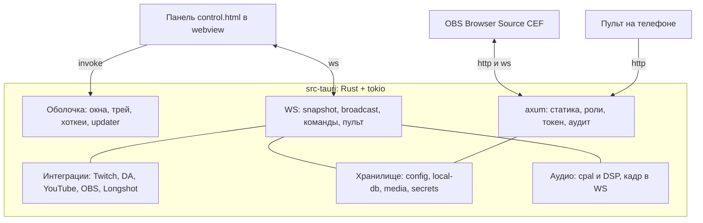

# Полный порт OSE на Tauri 2 (Rust)

Оценка от 28.09.2026. **Статус: порт завершён — волны 0–7 закрыты, Electron-версия
убрана из дерева; за владельцем остаётся слияние в `main` и релиз.**

Решение: нативная версия делается на **Tauri 2** с бэкендом на Rust и **полным
переносом** (без Node-сайдкара). Фронт — HTML/CSS/JS — остаётся как есть; это
главный выигрыш перед вариантом на Qt, где весь дизайн пришлось бы рисовать
заново виджетами.

Исходная точка: Electron-версия **3.2.8**, ветка `main`, рабочее дерево чистое,
80 наборов / 728 тестов зелёные.

## Короткий вывод

- **Фронт не переписывается.** Панель, оверлей, пульт, окна-редакторы и
  `shared/*.js` работают как есть: `preload.js` фанарит весь нативный API в
  `window.desktop.*`, и этот шов меняется на вызовы Tauri.
- **Переписывается бэкенд**: `server/**` (~25 модулей + 8 интеграций) и
  `main.js` (оболочка) — на Rust.
- **Оверлей у OBS — по-прежнему обычная веб-страница** по `http://127.0.0.1:порт`.
  Это вообще не меняется: OBS грузит её своим CEF.
- **Риски**: рендер панели в WebKitGTK (Linux), аудио на трёх платформах,
  прозрачные/сквозные окна HUD, новая упаковка и автообновление.
- **Срок**: один разработчик — ориентировочно **1.5–3 месяца** до паритета по
  функциям, если идти волнами ниже.

## Что уже сделано

Порт на Tauri вытеснил Electron из дерева (Electron — в истории и в локальном бэкапе `backup/electron-backend/`):

- **Каркас** — `src-tauri/`: Tauri 2 + `axum`. Панель открывается в системном
  webview (WebView2) и грузится по HTTP с нашего сервера (порт из
  `config/config.json`), статика отдаётся для `control/`, `overlay/`, `remote/`,
  окон-редакторов, `shared/` и `assets/`. Корень каталога без слэша редиректится
  на слэш (301), как `express.static`: иначе относительные `style.css`/`remote.js`
  пульта разрешались бы от `/` и страница открывалась бы без стилей и скрипта. Сборка — 2м15с, debug-exe 14.9 МБ.
  Крейт разделён на `lib` (ядро, тестируемое) и тонкий `bin`.
  **Спайк A пройден** (28.09.2026): «окно всё ок» — панель в WebView2 рендерится
  как надо, владелец подтвердил. Значит главный риск Tauri для этого проекта
  (перенос тяжёлого HTML-дизайна в системный webview) снят.
- **Аудио-ядро** — `src-tauri/src/audio/`: формат кадра микрофона
  (`frame.rs`, те же 371 байт и правила, что в `shared/mic-frame.js`) и конвейер
  «уровень — осциллограмма — спектр» (`dsp.rs`, порт `micBridge.tick` вместе с
  настройками `AnalyserNode`: `fftSize` 2048, сглаживание 0.6, шкала −100…−30 дБ).
  `clippy -D warnings` чистый. См. решение по микрофону ниже.
- **Тесты сервера** — ходят по серверу как клиент (`oneshot`), не поднимая порт:
  отдача панели по `/` и `/control/control.html`, общие ресурсы и оверлей, 404
  на чужой путь, `/healthz` (JSON, `no-store`, без путей) и `/support-bundle`
  (текст, `text/plain`, имя файла в `Content-Disposition`; из сети — `403`,
  `support_bundle_is_refused_from_the_network`). Редирект корня каталога без
  слэша держит отдельный тест (`directory_roots_redirect_to_the_trailing_slash`).
  Разбор порта из
  настроек (мусор, границы `u16`, битый файл) проверяется у диагностики.
  Статика берётся из **настоящего** репозитория — тест ловит переименование
  страницы, — а состояние — во временном каталоге, чтобы не трогать данные
  пользователя.
- **Пути хранилища** — `src-tauri/src/storage/paths.rs`: где лежат настройки,
  база, логи, медиа и состояние окна; отдельно — куда **можно** писать (в
  разработке рядом с исходниками, в собранном приложении — портативный каталог
  или системный), и проверка видимости сохранённого окна на текущих экранах.
- **Атомарная запись** — `src-tauri/src/storage/atomic.rs`: запись через временный
  файл с переименованием, уборка осиротевших временных файлов, ротация бэкапов
  (`<файл>.bak.0…2`, сдвиг слотов, отказ на пустом и слишком большом снимке).
- **Асинхронная запись** — `src-tauri/src/storage/async_store.rs`: отдельный поток,
  схлопывание частых снимков (на диск уходит последний), повторы переименования
  на «файл занят» (антивирус/индексатор на Windows), бэкап по времени, `flush` /
  `flush_sync` и телеметрия со строкой отчёта. Переименование подменяется в тестах —
  так и проверяется схлопывание без гонок по времени.
- **Порядок ключей**: `serde_json` включён с `preserve_order`. По умолчанию он
  складывает объекты в `BTreeMap` и переписал бы `config.json` с сортировкой
  ключей — файл разошёлся бы с тем, что пишет Electron (`JSON.stringify`
  сохраняет порядок вставки), а резервные копии стали бы нечитаемыми.
- **Целостность файлов** — `src-tauri/src/storage/integrity.rs`: битый файл не
  удаляется и не затирается, а уходит в карантин (`<файл>.corrupt-<метка>`),
  значение поднимается из последней удачной копии, случай порчи пишется строкой
  в `logs/recovery-<дата>.log` и возвращается событием — по нему главное окно
  покажет диалог. Там же описание слотов бэкапов для списка «Резервные копии».
  Два осознанных отличия от JS: повторный карантин в ту же секунду получает
  числовой хвост (в JS `rename` на Windows затирал предыдущую улику), и список
  событий не глобальный — событие возвращает сам вызов, собирает вызывающий.
- **Файл настроек** — `src-tauri/src/storage/config_file.rs`: документ настроек с
  главным контрактом совместимости — ключи, которых эта версия не знает (настройки
  будущих версий, чужие правки руками), **не теряются** при чтении и записи.
  Поэтому документ — это `serde_json::Map` с `preserve_order`, а не структура с
  полями: структура «съела» бы лишнее на первой же записи. Открытие повторяет
  `readConfig`: порча переживается, поднятое из копии сразу становится рабочим
  файлом, а при отсутствии настроек записывается шаблон поставки — ровно тем
  текстом, каким он лежит в поставке. Секреты пока проходят как есть.
- **Секреты** — `src-tauri/src/storage/secrets.rs`: свой формат (блоб DPAPI по
  открытому тексту). Формат Electron повторён **не был**, и это осознанное
  решение по итогам разбора (подробности ниже); старые значения распознаются по
  маркеру `v10` и уходят в разряд `unreadable` — панель скажет «введите ключ
  заново». Причина различается с «не заполнено», иначе зашифрованный вид уехал
  бы в сервис вместо секрета и тот ответил бы невнятным `invalid_client`.
  Хранилище подключено к документу настроек (`config_file.rs`): при открытии
  зашифрованные строки расшифровываются (`decryptConfig`), при записи —
  шифруются (`encryptConfig`), в памяти значения открытые. Нечитаемый секрет
  становится пустым, а его метка — в замечаниях, откуда её берёт
  `clientSecretUnreadable` в снимке, а при старте показывается диалог
  (`lib.rs`, как `getSecretIssues` в `main.js`) — для Twitch и YouTube другого
  места, где это видно, нет. Там же — диалог о повреждённых файлах состояния
  (`getRecoveryEvents`). Рядом — `examples/open_sealed.rs`: пробник, чтобы
  проверять такие значения руками.
- **История событий** — `src-tauri/src/storage/history.rs`: append-only JSON Lines с
  лёгким индексом (смещение, длина, время, тип, sessionId, карта id→позиция),
  фильтрами и поиском по нику/тексту, пагинацией, уплотнением с гистерезисом,
  миграционной перезаписью, удалением по фильтру и синхронным сбросом на выходе.
  Ленивая индексация, терпимость к битым строкам, повтор записи после сбоя с
  бюджетом попыток — всё как в `history-store.js`.
  Отличия там, где JS опирается на однопоточность: состояние лежит под одним
  замком, ввод-вывод идёт без него, а перед чтением файла вызов ждёт окончания
  прохода воркера (`wait_for_idle`) — иначе индекс мог бы посчитать полубатч
  дважды. Ещё одно следствие потоков: в JS очередь копится до микрозадачи, и
  порог уплотнения срабатывает сам; здесь воркер сливает её сразу, поэтому с
  заданным лимитом индекс строится уже на первом событии — иначе порог
  `index + pending` не сработал бы никогда и файл рос бы без предела (эту
  ловушку поймал прогон теста десять раз подряд).
- **База** — `src-tauri/src/storage/db.rs`: снапшот `local-db.json` (раскладка, пресеты,
  сессии, настройки виджетов, счётчики) плюс две append-only истории рядом
  (`local-db.jsonl`, `local-db.chat.jsonl`). Тот же набор операций, что в `db.js`:
  сессии с агрегатами, донаты и чат, лимит истории, варны модерации, язык,
  очистки, отчёт о хранилище, список и откат резервных копий, одноразовая
  миграция `stream_events`/`chatMessages` из снапшота в JSONL.
  Два неочевидных места, где пришлось аккуратничать: `deepDefaults` считает
  «значения нет» и для явного `null`, а числа, которые JS печатает как `10`,
  `serde_json` печатает как `10.0` — для полей настроек есть вывод числа «как в
  JS» (без дробной части у целых), иначе `local-db.json` расходился бы с файлом
  Electron-версии буквально в каждом поле.
- **Медиа, журнал, диагностика** — `src-tauri/src/storage/`:
  `media.rs` (список файлов, уборка мусора по ссылкам из настроек и раскладки,
  экспорт/импорт base64 с защитой от выхода из каталога), `logger.rs` (консоль,
  шина через трейт `LogBus`, суточный файл `logs/ose-YYYY-MM-DD.log` с ротацией
  и уборкой старше 7 дней), `crash_guard.rs` (отчёт `logs/crash-*.log` с
  версиями, платформой и памятью, сброс состояния, диалог, выход; хук паники
  вместо `uncaughtException`, упавшая фоновая задача вместо `unhandledRejection`
  со штормовым ограничением отчётов), `export.rs` (CSV истории),
  `audit_log.rs` (кольцевой буфер команд с безопасными полями) и `perf.rs`
  (накопитель задержек и строка отчёта: в Rust единственного event loop нет,
  поэтому арифметика отделена от того, кто ставит таймер).
- `deprecation-filter.js` **не переносится**: он подавляет `DEP0040` из
  `process.emitWarning`, а в Rust такого источника предупреждений нет.
- **Отчёты о состоянии** — `storage/health.rs` (отчёт `/healthz`: метрики без путей
  к файлам, короткий список проблем по порогам) и `storage/longrun.rs`
  (образцы памяти, клиентов и переподключений раз в интервал, скорость роста
  и строка в журнал только при поводе). У наблюдателя за прогоном нет таймера:
  кто и как часто зовёт `report`, решает вызывающий.
- **Роуты диагностики** — `src-tauri/src/diagnostics.rs` плюс `/healthz` и
  `/support-bundle` в `server.rs`: состояние (настройки, база, журнал команд,
  замеры задержек, образцы прогона, клиенты шины, службы, сессия и счётчики
  доступа) живёт одним объектом, а отчёты собираются из него — чтобы короткий
  отчёт и отчёт для поддержки не разъезжались. Порт — единый источник для
  роутов, окон и отчёта (`Diagnostics::port`): зашивается при привязке и
  меняется при смене порта на ходу. Отчёт для поддержки отдаётся текстом
  с именем файла, как в Electron. Путей и секретов в сетевом отчёте нет.
  Отчёт для поддержки при этом отдаётся **только с loopback**: сервер слушает и
  сеть, поэтому запрос из сети получает `403` (счётчик отказов и запись в журнал).
- **Правила доступа** — `src-tauri/src/server/access.rs`: кто «свой» (loopback без
  кода, сеть — с кодом из `?token=` или заголовка `x-ose-token`), проверка
  источника WebSocket (браузеры не применяют к нему политику одного источника),
  чтение роли из query, сравнение кода без раннего выхода по байтам и
  ограничитель частоты команд с подменяемыми часами. Это чистые решения от
  адреса, заголовков и query — поэтому их можно перебрать тестами, не поднимая
  сокет. Два осознанных отличия от JS: «свой» — весь `127.0.0.0/8`, а не четыре
  строки, и частный IPv4 проверяется всеми четырьмя октетами (`192.168.abc.def`
  за частный адрес больше не сходит). Сам сервер слушает `0.0.0.0`
  (`Ipv4Addr::UNSPECIFIED`), как `server.listen(port)` в Electron, — иначе пульт
  (`/remote?token=…`) не открылся бы с телефона. Сам `Upgrade` подключится
  вместе с командами — иначе панель подключалась бы к молчащей шине и ждала
  состояния, которого ей никто не шлёт.
- **Очередь алертов** — `src-tauri/src/alerts.rs` плюс подключение в
  `diagnostics.rs`: одна очередь на всё приложение (что играет, что ждёт),
  правила (минимальная сумма, объединение подряд идущих донатов одного зрителя),
  пауза со сроком и до снятия вручную, пропуск/поднять/проиграть
  сейчас/очистка, счётчики и снимок для панели. Часы и таймеры инжектируются,
  поэтому ритм («следующий — после длительности и хвоста анимации»)
  проверяется переводом часов, а не ожиданием. В приложении таймеры ставит
  рантайм Tauri (`schedule_timer`), `onPlay`/`onChange` рассылают `alert` и
  `alert_queue_update`, снимок входит в состояние как `alertQueue`, а оверлею
  при переподключении текущий алерт отдаётся заново. Команды
  `cmd_test_alert`/`cmd_alert_queue_*` подключены, срок паузы живёт в настройках
  и восстанавливается при старте.
- **Словарь протокола** — `src-tauri/src/protocol.rs`: типы событий, список
  служб связи и длительности алертов из `shared/events.js`. Строки на проводе —
  контракт с панелью и оверлеем, поэтому источник правды — JS-файл, а тест
  читает его из репозитория и сверяет словарь в обе стороны: переименование
  события в JS уронит `cargo test`, а не разъедется молча.
- **Помощники протокола** — `src-tauri/src/server/utils.rs`: тестовые алерты по
  видам (`build_test_alert`, длинный текст — ровно 200 символов), тип события для
  истории (`event_type_for_kind`), сборка записи `local-db.jsonl`
  (`to_stream_event`) и правило «скрывать ли колесо» — всё из
  `tests/server-utils.test.js`. Одно отличие от JS: время записи передаётся
  снаружи (в JS внутри был `Date.now()`), поэтому запись проверяется точным
  значение. Случайное имя тестового зрителя берётся из `uuid`, а не из нового
  источника случайности.
- **Каталог виджетов** — `src-tauri/src/catalog.rs`: что можно поставить на
  оверлей (41 вид), умолчания и минимальные размеры, 3D-виджеты тем и роли для
  кросс-темной подмены (`widgets_for_theme`, `widget_role`,
  `resolve_type_for_theme`, `theme_allows_widget`, `replaced_by_3d`,
  `is_animated`). Данные **не переписаны руками**: их снимает с
  `shared/widget-catalog.js` скрипт `src-tauri/tools/build-widget-catalog.mjs`
  в `catalog_data.json` — 41 вид по десятку полей, и один неверный `minW` тихо
  разошёлся бы с фронтом. Рядом лежит отпечаток исходника (FNV-1a 64), и тест
  его сверяет: поправили каталог в JS — `cargo test` скажет, что пересобрать
  (`node src-tauri/tools/build-widget-catalog.mjs`).
- **Встроенные темы** — `src-tauri/src/themes.rs`: десять тем с токенами цвета,
  шрифта и формы плюс шесть 3D-стилей — данные из `shared/themes.js`, снятые тем
  же способом (`node src-tauri/tools/build-themes.mjs` → `themes_data.json`,
  отпечаток исходника рядом). Сборка токенов из семян для своих тем — это уже
  логика (`shared/theme-engine.js`), и она идёт следом. Здесь же перенесён
  пропущенный ранее тест: список 3D-стилей обязан совпадать с наборами 3D-виджетов
  каталога — иначе в панели появится стиль без виджетов или наоборот.
- **Движок тем** — `src-tauri/src/theme_engine.rs`: сборка токенов своей темы из
  семян (перевод цветов hex↔HSL, светимость и контраст по WCAG, вывод ролей и
  поверхностей, формы панелей, свечение и рамка, точечные переопределения) —
  порт `shared/theme-engine.js`, уже логика, а не данные. Проверяется эталоном:
  `tools/build-theme-engine.mjs` считает токены настоящим JS-движком для 26
  наборов семян, и тест требует совпадения символ в символ (обе схемы, все формы
  панелей, пустые и неизвестные значения, светлый фон в тёмной схеме). Это важно:
  главная работа движка — довести акценты и текст до читаемого контраста, и
  расхождение здесь видно глазом только на живом оверлее.
- **Состояние: раскладка** — `src-tauri/src/state/`: порт `server/state.js` идёт
  частями, начали с раскладки и её пресетов (`state/layout.rs`): добавить, сдвинуть
  с ограничением по каталогу, убрать, поднять/опустить по слоям, записать раскладку
  целиком из HUD-режима, найти таймер Executive Hangar, сохранить/применить/
  удалить пресет (вместе с темой, с которой он сохранён). Отличие от JS: там
  раскладка живёт в памяти (`this._layout`) и правится на месте, здесь каждый
  вызов читает и пишет `Database` — второй копии состояния нет. В `state/mod.rs` —
  общее для будущих частей: своя тема по идентификатору и размерность темы.
- **Состояние: счётчики рантайма** — `src-tauri/src/state/runtime.rs`: часть
  `server/state.js`, которая **не** сохраняется на диск и потому живёт отдельным
  `Runtime`, а не в настройках: сколько раз каждая служба пробовала подключиться
  (`connecting` после обрыва — это переподключение), активная сцена с моментом
  старта, ракурс камеры, фильтры, розыгрыш «Колесо Фортуны», последние события,
  подписчики/фолловеры и касса текущего стрима. Отличия от JS осознанные: часы
  передаются снаружи (в JS внутри стоял `Date.now()`, но «сцена началась в этот
  момент» иначе не проверить), а случайный выбор на колесе берёт байты `uuid`, а
  не новый генератор. Участники и фильтры хранятся упорядоченно и без дублей
  (в JS — `Set`), чтобы порядок в снимке совпадал. Опрос пока не тут: его
  настройки пишутся в конфиг и будут вместе со следующим срезом.
- **Состояние: голосование** — `src-tauri/src/state/poll.rs`: настройки опроса
  (команда, тип диаграммы, пункты) живут в `config.json` и в базе, ход
  голосования — в `Runtime`. Перенесены `pollSnapshot`,
  `start`/`stop`/`reset`, `setPollConfig`, добавление/удаление/очистка пунктов,
  `votePoll`, `handlePollChat`, `testPollVotes` и пресеты (`list`/`save`/`apply`/
  `delete`). Перед голосованием видно, почему так: `_savePollConfig` пишет
  и в конфиг, и в базу, иначе команда и варианты откатывались при перезапуске; а
  удаление пункта вместе с ним снимает и голоса за него. Одно отличие от JS
  осознанное: мусорные пункты (без строковых `id`/`label`) там доживают в конфиге
  до следующего запуска, здесь чистятся сразу — иначе снимок показывал бы пункты,
  в голосовании всё равно не участвующие.
- **Состояние: внешний вид и темы** — `src-tauri/src/state/appearance.rs`: выбор
  темы («семейство» — базовая тема плюс 3D-вариант под флагом `enable3d`),
  список тем для панели, свои темы (сохранение с гранулярными переопределениями
  и выводом токенов движком, копирование, удаление), активные 3D-виджеты,
  настройки редактора (сетка, привязка, пропорции) и HUD (хоткеи, экран, окно
  чата поверх игры). Миграция старых форм внешнего вида (один `activeThemeId`,
  пары `activeThemeId2d`/`3d`) вынесена в `migrate_appearance` — её зовёт тот,
  кто открывает настройки при запуске, как это делал конструктор `state.js`.
  Своя тема с не-объектными `seeds` (или вовсе без них) не роняет сервер, а даёт
  цвета по умолчанию — тот же случай, который ловил JS-тест.
- **Состояние: настройки** — `src-tauri/src/state/config.rs`: цель сбора,
  очередь алертов (включая срок паузы, чтобы перезапуск её не снимал), канал и
  порт, OBS (хост, порт, пароль, сцены, команды, ракурсы и фильтры камер),
  звуки, Stream Deck, TTS и озвучка донатов, чат-бот с правилами модерации,
  товары Twitch, ключи приложения и токены, включение служб и уведомления.
  Два правила панели повторены дословно: секрет не сохраняется пустым (пустое
  поле — «не менять», иначе кнопка «Подключить» стирала бы рабочие ключи и
  сервис отвечал `invalid_client`), а пароль OBS стирается только явным
  `clearPassword`. Сцены и `replaceConfig` идут следом — им нужен каталог сцен.
- **Состояние: сцены и импорт настроек** — `src-tauri/src/state/scenes.rs` плюс
  нормализация и `replace_config` в `state/config.rs`: семь полноэкранных сцен
  (умолчания из `shared/scenes-catalog.js`), сплеш, крупный донат и импорт чужого
  файла настроек. Импорт собирает документ из известных разделов, как
  Electron-версия: код доступа и HUD-ключи остаются свои, чужая пауза очереди
  снимается, а невалидный массив не стирает текущий — и только этот путь
  осознанно теряет неизвестные ключи (для этого у `ConfigFile` появился
  `replace`; обычная запись соседей не трогает).
- **Нормализация настроек** — `normalize_config` в `state/config.rs`: порт
  нормализации конструктора `state.js` — доливает умолчания в старый
  `config.json` (внешний вид, редактор, HUD, уведомления, окно чата, сцены и
  сплеш, YouTube, OBS, звук, Stream Deck, TTS, опрос, бот, товары, цель, очередь
  алертов), при этом уже лежащие значения побеждают, а чужие ключи не теряются.
  Код доступа сюда не входит — он волны 2.
- **Снимок состояния** — `src-tauri/src/state/snapshot.rs`: сборка `STATE` из всех
  частей (настройки, раскладка и пресеты, счётчики рантайма, опрос, темы).
  Снимок уходит всем клиентам, поэтому секретов в нём нет: пароль OBS — пустая
  строка плюс признак `hasPassword`, клиентский секрет DonationAlerts — только
  `hasClientSecret` и `clientSecretUnreadable` (секрет расшифрован при открытии
  настроек, поэтому нечитаемый виден как пустой, а флаг просит ввести ключ
  заново). Собран по ключу, а не одним `json!`: макрос раскрывается вложенно и на
  полусотне полей упирается в предел рекурсии компилятора. На этом `state.js`
  перенесён целиком.
- **Шина (транспорт)** — `/ws` в `src/server/mod.rs`, реестр клиентов в
  `src/server/bus.rs`, словари в `src/server/locales.rs`: подключение проходит
  проверку допуска (`server/access.rs` — источник, код, роль), клиент попадает в реестр,
  а первыми кадрами получает `LOCALES` и `STATE`. Кадры от клиента читаются и
  фиксируются в журнале команд и ограничителе частоты, но команды ещё не
  разбираются — это следующий шаг; молчащей шины при этом нет: состояние клиент
  уже получает. Реестр и счётчики отказов живут вместе с диагностикой, поэтому
  `/healthz` теперь показывает настоящие `clients`/`byRole`, состояния служб и
  раздел `security` (отказы и журнал команд). На старте настройки нормализуются
  (`Diagnostics::normalize`) — как конструктор `state.js` при чтении с диска.
- **Слой команд** — `src/server/commands.rs`: разбор `handleClientCommand` из
  `server/index.js`. Каждая ветка `match` по `event_types::CMD_*` зовёт уже
  перенесённую функцию `state/*` и рассылает то же, что Electron-версия
  (раскладка и пресеты, цель, темы и свои темы, редактор, сцены/сплеш, крупный
  донат, опрос с пресетами, розыгрыш, HUD, язык, уведомления, настройки OBS/
  звука/бота/TTS/озвучки/Stream Deck/товаров, включение служб, сброс счёта
  стрима, пересылка микрокадров). Блокировки настроек и рантайма берутся на
  время работы и отпускаются до рассылки — `broadcast` состояния сам берёт те же
  замки, и вложенный захват заклинил бы поток (эту ловушку поймал прогон: лишний
  `self.config()` в одном выражении повесил отчёт для поддержки). На момент
  переноса слоя команд ветки, которым нужны интеграции (OBS, Twitch, YouTube,
  DonationAlerts, камеры, CLIP/marker), были ещё не готовы — с волной 3 они
  подключены (включая саундборд `cmd_test_soundboard` и клип/маркер); очередь
  алертов подключена; CLI живёт в `server/cli.rs`, смена порта на ходу — в
  `ServerControl` (`server/mod.rs`), управление окнами поверх игры уходит в
  оболочку через `HudHost` (волна 4). Неперенесённых веток не осталось;
  неизвестные команды игнорируются — как `default` в JS.
- **Модерация чата** — `src-tauri/src/integrations/chat_moderation.rs`: порт
  `server/integrations/chat-moderation.js`. Движок только решает, что делать
  (ссылки с учётом whitelist и поддоменов, мат через делейтизацию латиницы и
  сжатие пробелов, капс, смайлы, цепочка «варн → таймаут → бан»); таймауты и
  баны отправит тот, кто подключён к чату (волна 3). Счётчик варнов — точка
  внедрения ([`WarnsBackend`]): умолчание — память, в приложении — база
  (`moderation_warns`), чтобы варны пережили перезапуск. Кэш чистой части вердикта
  отделён от метаданных: смайлы и счётчик варнов зависят от пользователя и
  сообщения, а не от строки, поэтому по тексту не кэшируются. Регулярного
  выражения здесь нет — адрес разбирается по словам, как и в `support_bundle`.
- **Чат-бот** — `src-tauri/src/integrations/chat_bot.rs`,
  `chat_bot_control.rs`: порт `server/integrations/chat-bot.js`. Движок команд и
  таймеров: сопоставление по префиксу, уровни прав и кулдауны, шаблоны
  `$(user)`/`$(args)`/`$(count)` и `$(random a|b)`, встроенные
  `!uptime`/`!so`/`!8ball`/`!roll`/`!commands`, таймеры с порогом активности в
  чате. Часы передаются снаружи — иначе кулдаун и таймеры не проверить. Шаблоны
  разбираются по символам, без регулярного выражения. Обвязка `startChatBot`
  подключена: сообщения `chat_message` (только `source: twitch`) идут в движок и
  авто-модерацию, ответы и баны/таймауты уходят через `ChatSender` (фоновая
  задача), команды `!timeout`/`!ban` знают ID авторов по их сообщениям, а свои
  ответы бот помнит и не отвечает на них (эхо через Helix). Таймеры проверяются
  раз в 15 секунд. Варны модерации живут поверх базы (один счётчик на бота),
  поэтому переживают пересборку движка и перезапуск — как `state.db` в JS.
- **Синхронизация Longshot** — `src-tauri/src/integrations/longshot_sync.rs`: порт
  `server/longshot-sync.js`. Живой конфиг Executive Hangar тянется из API
  Longshot с кэш-бастером, при сбое — со статического адреса, при полном
  сбое сохраняется прежний анкер (меняется только признак ошибки). Даты
  приводятся к UTC-ISO, причём строка без зоны читается как UTC — как это
  делает сам сайт. `fetch` инжектируется (разбор и фолбэк проверяются без сети),
  часы тоже; опрос ленивый — `set_active` только помнит флаг, интервал ставит
  вызывающий. Тест на ленивый опрос с настоящими таймерами не переносится: здесь
  таймеров у модуля нет по устройству. Вызывающий теперь есть — `Diagnostics`:
  цикл на `tokio` раз в интервал, активность считает `has_timer_widget` (видимый
  таймер в раскладке), новый снимок идёт в `STATE` и кадром `longshot_update`,
  а `cmd_refresh_longshot` тянет анкер по кнопке; команды раскладки и импорт
  настроек пересчитывают активность.
- **Twitch Helix** — `src-tauri/src/integrations/twitch_helix.rs`: порт
  `server/integrations/twitch-helix.js` (клип и маркер стрима). Сеть и токены
  инжектируются: HTTP — это `PostFn`, а «добыть токен» и «обновить токен» — два
  замыкания `Tokens`; так проверяются сетевой сбой и повтор после `401` без сети.
  Правило, ради которого слой отдельный: сетевой сбой не роняет обещание, а
  возвращает `{ ok: false, error: "network" }` — панель ждёт результат, а не
  исключение. Модуль обновления токенов (`token-refresh`) подключён. Команды
  `cmd_create_clip` и `cmd_create_stream_marker` подключены: ответ уходит кадром
  `twitch_action_result` (`action: "clip"`/`"marker"`).
- **Обновление токенов** — `src-tauri/src/integrations/token_refresh.rs`: порт
  `server/token-refresh.js`. Общий для Twitch/YouTube/DonationAlerts: склейка
  конкурентных обновлений (вызов, начавшийся до чужого завершения, берёт его
  результат), обмен `refresh_token` на `access_token`, сохранение срока и
  `ensureAccessToken`. Сеть и часы инжектируются. Два правила повторены дословно:
  пустые ключи приложения — ошибка **до** запроса, со словом `invalid_client` в
  тексте (по нему отличают «нужны действия пользователя» от сетевого сбоя), а
  зашифрованное `enc:…` считается отсутствующим.
- **Цвет ника** — `src-tauri/src/integrations/nick_color.rs`: порт
  `server/nick-color.js`. Тон берётся из FNV-1a по стабильному идентификатору
  (канал/зритель), насыщенность и светлота зафиксированы — при них любой из 360
  оттенков читается на самой тёмной панели оверлея (минимальный контраст около
  5.6:1, выше порога WCAG AA). Без идентификатора остаётся прежний единый цвет.
  Хеш считается по UTF-16 code unit, как `charCodeAt` в JS; тест требует, чтобы
  палитра покрывала весь круг оттенков, а не половину.
- **Twitch-чат** — `src-tauri/src/integrations/twitch_chat.rs`,
  `twitch_chat_socket.rs`, `twitch_chat_control.rs`: порт
  `server/integrations/twitch-chat.js`. Чтение — анонимный IRC (`justinfan`):
  разбор строк с тегами в форме `tmi.js` (пробел, CR/LF, `;` и `\`
  разэкранируются; `badges`/`emotes` — в объекты), `PING`→`PONG`, `001` —
  соединение установлено, а `username` берётся из префикса (в тегах его нет).
  Рукопожатие `CAP REQ`/`PASS`/`NICK`/`JOIN`, драйвер `run_chat` с инжектируемым
  транспортом (протокол проверяется каналом, без сети) и настоящий сокет на
  `tokio-tungstenite`. Контроллер подключения инжектирует и транспорт, и запуск
  задачи, поэтому сам проверяется фейками; он же запускается при старте, при
  смене канала, по `cmd_restart_integration` и оживляет `cmd_test_chat`
  (тестовые сообщения — тем же списком зрителей и текстов, что в JS).
  Сборка сообщения (цвет — из тега, иначе из `nick-color` в порядке user-id →
  username → display-name) и отправка/модерация через Helix с паузой между
  сообщениями (общий счётчик слотов). Сеть и токены инжектируются; сетевой сбой
  возвращает `{ ok: false, error: "network" }`, а пустое сообщение и пустой
  `user-id` отсекаются до запроса. Чего ещё нет: TLS включён (`native-tls` у
  сокета), поэтому `wss://irc-ws.chat.twitch.tv` работает — живое подключение
  проверено вручную (приходят `001`, `JOIN`, `ROOMSTATE`); `cmd_send_chat` тоже
  подключён: отправка идёт фоновой задачей настоящим `reqwest`
  (`integrations/http.rs`), результат уходит кадром `chat_sent`. Статусы служб
  теперь пишутся в рантайм (`bus_emit`), поэтому `/healthz` их видит.
- **Настоящая сеть** — `src-tauri/src/integrations/http.rs`: адаптеры `reqwest`
  под уже введённые точки внедрения — `PostFn` для Helix (`Client-Id` из настроек
  в момент вызова плюс `Bearer`) и `FormFn` для обмена токенов (форма
  собирается вручную, чтобы не зависеть от сериализатора). Сбой сети даёт
  `status: 0` и пустое тело — по нулю вызывающий отличает «не дошло» от ответа.
- **События Twitch (EventSub)** — `src-tauri/src/integrations/twitch_eventsub.rs`,
  `twitch_eventsub_control.rs`: порт `server/integrations/twitch-eventsub.js`.
  Чистый слой: подписки, подбор ракурса камеры и фильтра по названию награды
  (без учёта регистра и внешних пробелов), правило товара по id/названию,
  подстановка `{user}`/`{reward}`/`{input}` и превращение уведомления в события
  шины (follow/sub/gift_sub/cheer/баллы канала → алерт, счётчики, саундборд,
  камера). Транспорт подключён: сокет с TLS, подписка через Helix (с повтором
  после `401`), `session_welcome` → подписка, `session_reconnect` →
  переподключение без переподписки (Twitch её хранит), `notification` → события
  шины. События применяются обработчиками, которые в JS висят на `bus.on`: алерты
  — в очередь (с длительностью по словарю), счётчики фолловеров/подписчиков — в
  рантайм и `stat_update`, саундборд и озвучка награды — сразу. Запросы
  `camera_angle_request`/`camera_filter_request` уходят в OBS, `reward_scene_request`
  переключает сцену. Сторожа keepalive нет — о разрыве сообщает сокет.
- **Побочные эффекты алерта** — хвост `bus.on("alert")` из `index.js` подключён
  ко всем службам (`diagnostics.rs`, `apply_alert_side_effects`): алерт пишется в
  «последние события» (кадром `recent_event`), в историю
  (`to_stream_event` → `append_stream_event`, с `source_id`, чтобы подтянутое
  не считалось дважды), а донат ещё правит счёт текущего стрима (`session_stats`),
  цель сбора (`goal_update`) и лучший донат (`top_donation_update`). Колесо
  исключено — оно не событие стрима, как в JS; подтянутые донаты (`recovered`)
  идут в историю и цель, но не в «за этот стрим».
- **Цикл колеса на сервере** — `WheelCycle` в `diagnostics.rs`: порт `isSpinning`
  и трёх таймеров `createServer` (`autoSpinTimer`, `wheelHideTimer`,
  `spinTimeoutTimer`). Спин считается идущим, пока страница колеса не пришлёт
  `cmd_set_giveaway_winner`; предохранитель на 15 с снимает запрет, если источник
  в OBS перезагрузили и ответа не будет, — иначе «Крутить» залипло бы до
  перезапуска. Победитель заканчивает раунд: алерт `wheel_winner` (с
  `isElimination`/`isFinalWinner` и `durationMs` — 3000 на выбывании, иначе
  словарные 8000) уходит **мимо очереди**, как в JS; в режиме выбывания через
  1.8 с крутится следующий, а в обычном и на финале колесо прячется после
  карточки результата. `wheel_start` теперь тоже алерт (и у команды панели, и у
  пульта), а повторный `cmd_spin_wheel` во время спина молчит. Ход колеса и его
  таймеры держит `Diagnostics` — их правят и панель, и пульт, и CLI.
- **Второй проход сверки с Electron** (смоук владельца): найдены и исправлены
  расхождения, которые ломали реальное использование:
  - при подключении к шине теперь уходят четыре кадра конфигов оверлея
    (`overlay_participants_config`, `wheel_config`, `wheel_speed_config`,
    `overlay_mic_config`) — без них перезагрузка источника в OBS сбрасывала
    позицию/скорость колеса и настройки участников;
  - `cmd_set_integration_enabled` перезапускает службу, `cmd_set_obs_config` —
    OBS (раньше менялась только галочка до перезапуска приложения);
  - тестовый алерт идёт через шину (`emit_bus`), поэтому попадает в историю и
    «последние события»; алерты колеса уходят мимо очереди с `durationMs`;
  - `exec_cli_completion` перехватывается до лимитера и аудита (Tab не упирается
    в лимит и не засоряет журнал);
  - чат и EventSub переподключаются сами после обрыва (у чата — автоперезапуск
    tmi.js, у событий — цикл на 3 с), EventSub без токена/`broadcasterId` даёт
    `not_configured`, а не `error`;
  - повторный запуск фильтра OBS отменяет прежний таймер (поколения вместо
    `clearTimeout`), иначе фильтр гас раньше нового срока;
  - окно чата поверх игры создаётся `focusable(false)` — не выдёргивает фокус
    из игры; `save_support_bundle` отдаёт ключ `path`; `connect_twitch`
    перезапускает чат только при непустом канале;
  - мелочи, приближенные к JS: `uptimeSec` округляется (`Math.round`), память в
    МБ округляется, `history_max_records = null` снимает лимит,
    `normalize_bot_command` срезает один ведущий символ, `goal.currency`
    тримится и режется до 8, пустая координата `chatHud` — `null`,
    `barCount` приводится через `Number(x) || 32`, `getChat` с пустым
    `sessionId` не фильтрует;
  - `reward_scene_request` идёт полным `SCENE_SET` (маппинг сцен, заставка,
    активная сцена) через обработчик, который ставит оболочка;
  - подключение DonationAlerts к Centrifugo теперь с заголовками
    `Origin`/`User-Agent` (как `ws` в JS), а серверный `error`-кадр не рвёт
    сокет — пауза 15 с остаётся только за авторизационными ошибками;
  - нативные уведомления о событиях стрима (`onStreamAlert`) — через плагин
    уведомлений; в фокусе панели реальные события не дублируются, тестовые идут
    всегда;
  - F11 переключает полный экран панели (шим + команда `toggle_fullscreen`);
  - старая раскладка `config.layout` переносится в базу один раз при
    нормализации, а ключ удаляется; модерация берёт ник при пустом `userId`
    и смотрит исходный текст (без обрезки);
  - выдача разрешения на микрофон в WebView2 (`Builder::on_permission_request`: микрофон — `Allow`, камера — `Deny`, как audio-only в JS);
  - начальные счётчики фолловеров/подписчиков после подписки EventSub
    (`fetchInitialStats` — два `helix_get` и кадр `stat_snapshot`).

Осталось по второму проходу (не ломает основной сценарий либо требует
платформенного решения):

- сохранение и проверка геометрии окна чата: геометрию восстанавливает плагин
  `window-state`, а написанный `paths::merge_bounds`/`is_visible` (проверка
  видимости на текущих экранах) не подключён — при желании можно завести своё
  восстановление;
- `id` монитора числом для старых `hud_display_id` — однозначно смапить
  нечем (в Tauri у монитора нет числового `id`, как у `screen.getAllDisplays()`).

- **Сессия стрима и побочные эффекты чата** — при старте открывается сессия
  (`Database::start_session`, канал из настроек) и счёт донатов обнуляется; при
  выходе сессия закрывается (`RunEvent::Exit`). Её начало уходит в снимок
  (`sessionStartedAt` — граница «только этот стрим») и в `/healthz` (`session`).
  Там же хвост `bus.on("chat_message")`: не-тестовый чат пишется в историю с
  `sessionId`, а команда розыгрыша или опроса рассылает
  `giveaway_update`/`giveaway_participants` и `poll_update`.
- **Журнал подключён к шине и файлу** — `storage/logger.rs` уже был перенесён
  (консоль, `LogBus`, суточный файл с ротацией), теперь он подключён:
  `ClientLogBus` отправляет `terminal_log`/`debug_log` панели тем же кадром, что
  `bus.on(...)` в JS, `Diagnostics::logger(service)` выдаёт журнал службы, а при
  старте включается файловое логирование — поэтому отчёт для поддержки читает
  тот же сегодняшний журнал, что в Electron. Уже пишут: запуск сервера и
  добор донатов; остальные службы — по мере добавления записей в их модулях.
- **Слой оболочки (начало волны 4)** — `src-tauri/src/desktop.rs` и
  `src-tauri/preload-tauri.js`: `window.desktop.*` из `main.js`, но на
  `invoke`. Панель, оверлей и окна-редакторы остаются тем же JS — инициализационный
  скрипт окна подставляет мост до первой строки страницы. Готовы команды, не
  требующие плагинов: `get_info`, список экранов (`get_displays`), чтение базы
  (`db:get-*`, `db:clear-*`, лимит истории, включённость истории чата),
  `backup:list`, повтор события из истории (`replay_event`) и полный сброс базы
  (`db:reset-all` с перезапуском), а также текст отчёта для поддержки. Окна —
  через `WebviewWindowBuilder` (чат, редактор виджета, превью/примеры/редактор
  тем, закрытие текущего окна): страницы отдаёт тот же сервер, а в каждое окно
  подставляется тот же мост. Код доступа из сети готов: при старте он
  нормализуется или выдаётся заново (32 hex, как `crypto.randomBytes(16)`),
  `remoteUrl` попадает в снимок состояния, а `access:rotate-token` меняет код,
  отключает внешних клиентов и рассылает свежий адрес. Буфер обмена, открытие
  внешних ссылок и папки данных идут через плагины (`clipboard-manager`,
  `opener`); рядом зарегистрированы `dialog`, `fs`, `shell`, `global-shortcut`,
  `notification`, `single-instance`, `window-state` и `updater` (права — в
  `capabilities/default.json`). Диалоги и файлы тоже готовы: экспорт/импорт
  настроек (с раскладкой и медиа), экспорт/импорт темы, сохранение отчёта для
  поддержки, экспорт истории событий (CSV/JSON) и выбор файла медиа с копированием
  в каталог `media/`. Оболочка окна тоже готова: трей с меню «Открыть/Выйти»,
  клик по значку и второй запуск поднимают панель, а закрытие окна сворачивает
  её в трей — один раз с подсказкой (позиции окон хранит `window-state`).
  OAuth-подключения готовы: `server/oauth.rs` — чистый слой (адреса авторизации
  Twitch/DonationAlerts/YouTube, одноразовый `state` со сроком и привязкой к
  сервису, экранирование и тексты страницы-результата, разбор `invalid_client`
  и т.п.), команды `connectTwitch`/`connectDonationAlerts`/`connectYoutube`
  сохраняют ключи и открывают браузер, а роуты `/oauth/*/callback` обменивают
  `code` на токен (`form_post`/`helix_get`/`bearer_get`), при необходимости
  добирают профиль (`broadcasterId`, `userId`) и сохраняют токены, перезапуская
  службу — как `hooks.on*Connected` в JS. Окна поверх игры и хоткеи готовы:
  `src-tauri/src/hud.rs` держит прозрачный оверлей на весь экран (`hud-overlay`,
  сквозной клик через `set_ignore_cursor_events`, режим редактирования по хоткею)
  и окно чата поверх игры (`chat-hud`), а настраиваемые хоткеи HUD/чата,
  игровой режим (Ctrl+Shift+G) и закрепление чата (Ctrl+Shift+C) регистрирует
  `global-shortcut`; команды панели уходят в оболочку через трейт `HudHost`,
  а окно чата получило мост `window.chatDesktop` из `preload-tauri.js`.
- **DonationAlerts: разбор и транспорт** —
  `src-tauri/src/integrations/donationalerts.rs`, `donationalerts_control.rs`:
  порт `server/integrations/donationalerts.js`. Разбор payload доната (кандидаты
  поля озвучки, `id` → `sourceId`) и boosty-подписки (`boosty_sub`/`boosty_resub`
  по имени события), проверка «это донат, а не служебный кадр», дата `created_at`
  как UTC, нормализация строки REST-списка и обновление цели, разбор кадра
  Centrifugo. Транспорт: Centrifugo-сокет (JSON-lines, кадр `connect`, затем
  HTTP-подписка и `subscribe` в сокет), OAuth-данные через `user/oauth`, обмен
  токена с `redirect_uri`, повтор после `401`; переподключение с разными паузами
  для сетевого и авторизационного сбоя, `invalid_client` не повторяем;
  невосстановимость вынесена отдельной функцией. Сторож heartbeat не заведён —
  о разрыве сообщает сокет. События `alert` и `goal_external_update` уходят в те
  же обработчики шины, что у EventSub. Там же REST-добор пропущенных донатов
  (`fetch_recent_donations`, команда `cmd_recover_donations`): список донатов за
  время простоя, отсев показанных и уже известных по истории (`source_id`),
  публикация от старых к новым и отчёт кадром `alert_queue_update` —
  `insufficient_scope` при 401/403 просит переподключить DonationAlerts.
- **OBS WebSocket** — `src-tauri/src/integrations/obs_websocket.rs`,
  `obs_websocket_control.rs`: порт `server/integrations/obs-websocket.js`. Чистый
  слой: подпись пароля v5 (`base64(sha256(...))`, два прохода через `sha2`), кадр
  `Identify` на `Hello` (подпись только при challenge и пароле), кадр запроса
  (op 6), план переключения ракурсов (включить один источник, остальные
  выключить, вебкамеру не трогать) и длительность фильтра. Клиент: рукопожатие
  `Hello → Identify → Identified`, корреляция «запрос → ответ» с таймаутом 10 с
  (ответы по `requestId` в общей таблице, сокетом владеет одна задача, исходящие
  идут через канал), смена сцены без ожидания и реконнект. Поверх клиента —
  команды камер: `cmd_set_camera_angle` и `cmd_trigger_camera_filter` включают
  нужный источник и выключают остальные, а фильтр — с таймером автовыключения;
  события `camera_angle_changed`/`camera_filter_changed` обновляют рантайм и
  рассылают `camera_angle_update`/`camera_filter_update`. Также есть
  `toggle_webcam`/`toggle_mic_mute`. Записи журнала этого модуля ещё не
  добавлены — сама шина и файл для журнала уже подключены (см. ниже).
- **YouTube Live** — `src-tauri/src/integrations/youtube_live.rs`,
  `youtube_live_control.rs`: порт `server/integrations/youtube-live.js`. Чистый
  слой: классификация отказа `liveChatMessages` (`403` с причиной
  `liveChatEnded`/`liveChatDisabled`/`liveChatNotFound` или `offlineAt` в теле —
  чат мёртв, остальное — лимит), микро-суммы в валюту, сообщение чата (бейджи
  owner/mod/sponsor, цвет из `channelId`, иначе из ника) и алерт (Super Chat/
  Sticker → донат, участники → подписка), период опроса. Опрос: поиск эфира по
  `liveBroadcasts?mine=true` с проверкой `lifeCycleStatus` (`live`/`testing`/
  `ready`), запасной путь `videos.list` по `videoId` из настроек; обновление
  токена после `401` на обоих шагах; опрос `liveChatMessages` с `pageToken`;
  `404` и «мёртвый» `403` сбрасывают `liveChatId` и ищут эфир заново, лимит/
  квота ждут `QUOTA_BACKOFF_MS`; события `chat_message`/`alert` идут в те же
  обработчики шины, что у остальных служб. Тело отказа читается сырым текстом
  (`bearer_get_text`), потому что причина бывает и не-JSON. Записи журнала этого
  модуля ещё не добавлены.
- **Отчёт для поддержки** — `storage/support_bundle.rs`: сборка
  (`build_support_bundle` берёт окружение, отчёт о состоянии, счётчики записи,
  журнал команд, образцы долгого прогона, слоты бэкапов и карантин, хвост
  свежего отчёта о падении и сегодняшнего журнала) и текстовое представление
  (`render_support_bundle`), плюс слой приватности (`sanitize` по ключам
  `*secret*`/`*token*`/`*password*`, маскировка `enc:…`, токенов в URL и
  `Bearer`-заголовков, домашнего каталога, `count`, `normalizeAccessCode`).
  Настройки попадают в отчёт только сводкой по явному списку полей: секреты —
  отметками «заполнено/пусто» (`summarize_config`), раскладка — счётчиками по
  типам (`summarize_layout`) без координат. Регулярные выражения из JS разобраны
  руками — `regex` ради трёх шаблонов в этом пути не нужен; важное отличие от
  JS-версии: текст копируется целыми кусками, а не байт за байтом, иначе
  кириллица в отчёте превращалась бы в мусор (это и поймал тест на `enc:…`).
- Всего **615 тестов**, `clippy -D warnings` чистый.
- Найдена и исправлена гонка при синхронном сбросе истории: между «дождаться
  окончания прохода» и «взять замок» воркер успевал начать новый проход, и
  `flushSync` мог вернуться раньше, чем запись окажется на диске (падало только
  под нагрузкой — один прогон из четырёх). Теперь ожидание и взятие замка — одно
  действие (`lock_idle`), и оно же закрывает чтение файла в середине записи.
  Отдельно стоит помнить две связи с окружением: тесты файлового журнала
  идут по очереди (состояние логирования глобальное, как в JS), а тест хука
  паники ищет свой отчёт по содержанию — хук глобальный, и упади рядом
  другой тест, отчётов было бы больше одного.
- **Сверка с Electron**: эталоны уровня, волны, спектра и кадра сняты с настоящих
  `control.js`/`shared/mic-frame.js` и зашиты в тест — совпадение точное (кроме
  самого преобразования Фурье, см. ниже).

Отступление, которое надо помнить: **спектр — приближение** к `AnalyserNode`.
Окно, нормировка и сглаживание повторены по спецификации Web Audio, но побитового
совпадения с Blink не будет: оверлей рисует по спектру полосы, и одна и та же
музыка даёт один и тот же рисунок, а не одни и те же байты. Уровень, осциллограмма
и нарезка — точные (это арифметика над байтами).

### Решение: секреты шифруем своим форматом

Формат Electron повторён **не был**, и вот почему (разбор 28.09.2026):

- значение Electron — `enc:` + base64, внутри маркер `v10` и следом 49 байт на
  21 байт открытого текста. Для блоба DPAPI это слишком мало (у него одна только
  обвязка длиннее) — то есть это AES-GCM;
- ключ AES лежит **не** в `os_crypt.encrypted_key` из `Local State`: значение,
  собранное на этом ключе, сам Electron расшифровать отказался
  (`Error while decrypting the ciphertext provided to safeStorage.decryptString`).

То есть у Electron 43 на Windows своя, недокументированная схема хранения ключа,
и повторять её — значит зависеть от внутренностей, которые меняются от версии к
версии. Поэтому пишем блобом DPAPI (просто, привязано к пользователю системы), а
старые значения честно помечаем как `unreadable`: пользователь вводит ключи
один раз, а настройки, раскладка, темы и история переезжают без потерь.

### Решение: микрофон считает панель, как в Electron

Считаем звук **не** в Rust, а по-прежнему в панели через Web Audio
(`micBridge` в `control.js`): только там бесплатно есть эхоподавление,
шумоподавление и автоусиление — те самые `echoCancellation`,
`noiseSuppression` и `autoGainControl`, которые видны в настройках микрофона.
В `cpal` этого нет: голый захват дал бы заметную потерю против Electron, а
`webrtc-audio-processing` — тяжёлая C++-зависимость.

Поэтому роль Rust в аудио — **пересылка**: сервер узнаёт кадр по `frame::is_frame`
и передаёт его дальше, не разбирая (ради этого кодек и нужен в Rust).
`dsp.rs` остаётся готовым запасным путём: если на WebKitGTK `getUserMedia`
окажется нерешаемым, включается захват `cpal`, и тогда панель **читает** кадры с
сервера вместо отправки — небольшая правка `control.js`.

## Что откуда берётся

### Переиспользуется без изменений

| Что | Почему |
|---|---|
| `overlay/**` | грузится OBS в Browser Source (CEF) — от оболочки не зависит |
| `shared/**` (`widgets.css`, `themes.js`, `theme-engine.js`, `widget-catalog.js`, `events.js`, `twitch-emotes.js`, `mic-frame.js`, `icons.js`, локали) | единственный источник правды для оверлея и панели; фронт остаётся JS |
| `control/**`, `remote/**`, `chatwindow/**`, `splash/**`, `widgeteditor/**`, `themeeditor/**`, `csseditor/**` | HTML/CSS/JS, живут в webview |
| `assets/**`, `config/**` | ресурсы и пользовательские данные |
| `streamdeck-plugin/**` | говорит с приложением по HTTP — интерфейс не меняется |

Оговорка к таблице: `shared/**` остаётся как есть **для страниц в webview**, но
бэкенд и на Node читает часть этих модулей — `server/state.js` тянет
`widget-catalog.js` (умолчания, минимальные размеры и роли виджетов) и `themes.js`
с `theme-engine.js` (сборку токенов темы). Значит, для Rust это не
«переиспользуется без изменений», а **ещё один перенос**: без каталога виджетов и
токенов тем не собрать ни `state`, ни `cmd_add_widget`. Переписывать такое
руками нельзя — 41 вид по десятку полей разошёлся бы с фронтом тихо, — поэтому
каталог и темы **снимаются с JS скриптами** (`src-tauri/tools/build-widget-catalog.mjs`,
`src-tauri/tools/build-themes.mjs` → `catalog_data.json`, `themes_data.json`), а
отпечаток исходника в данных не даёт забыть пересобрать. Логика из `shared/**`
(сборка токенов своей темы) переносится руками, но тоже не на глаз: эталонный
набор считается настоящим JS (`tools/build-theme-engine.mjs`) и сверяется с
Rust-портом в обе стороны.

### Переписывается на Rust

| Что | Объём |
|---|---|
| `server/index.js` | ~2300 строк: express + `ws`, роли, токен, origin, лимиты, аудит, состояние, команды клиента, действия пульта, оркестрация интеграций |
| `server/*.js` (кроме `index.js`) | 25 модулей: хранилище, БД, история, медиа, секреты, логи, бэкапы, health, CLI, OAuth |
| `server/integrations/*.js` | 8 модулей: Twitch (чат/Helix/EventSub), DonationAlerts, YouTube, OBS WebSocket, бот, модерация |
| `main.js` | окна, трей, хоткеи, диалоги, автообновление, состояние окна |
| `preload.js` | ~50 методов `window.desktop.*` → JS-шим над `invoke`/`listen` |

### Контракты, которые менять нельзя

1. **Файлы данных**: `config.json`, `local-db.jsonl`, `local-db.chat.jsonl`,
   `window-state.json`, логи, `media/`. Rust обязан читать и писать те же
   структуры, включая **незнакомые ключи** (иначе конфиг «потеряет» настройки
   будущих версий) — `#[serde(flatten)] extra`.
2. **Секреты**: схема `secret-store.js`. Смена схемы = потеря входов у
   пользователей. Либо тот же формат, либо `keyring` с миграцией (решение в
   «Открытых вопросах»).
3. **Протокол оверлея**: роли WS (`overlay`/`remote`/`panel`), снимок состояния,
   имена сообщений из `shared/events.js`, формат бинарного кадра микрофона.
4. **Адрес оверлея** для OBS: реальный `http://127.0.0.1:<порт>`, а не
   `tauri://` — значит HTTP-сервер нужен в любом случае.

## Архитектура

Отличие от Electron: панель рисует **системный webview** (WebView2 / WebKitGTK /
WKWebView), а не встроенный Chromium. Оверлей у OBS — по-прежнему CEF. Это новый
класс расхождений «в панели чуть иначе, чем в эфире», о котором надо помнить.

## Волны

Каждая волна заканчивается тем, что можно проверить, и не ломает предыдущие.

### Волна 0 — каркас и спайки

- `src-tauri/` + Tauri 2; главное окно грузит **текущий** `control.html`.
- Поднять `axum` на порту из `config.json`, отдать `overlay/` — открыть в OBS.
- Замерить размер установщика и потребление памяти (ради чего всё затевается).
- Спайк аудио: `cpal` под Windows/macOS/Linux.
- Спайк Linux: отрендерить панель в WebKitGTK (`backdrop-filter`,
  `conic-gradient`, шрифты).
- Классифицировать все 80 наборов тестов: «остаётся Jest (фронт)» / «переезжает
  в `cargo test` (бэкенд)».

**Готово, когда**: оверлей и панель работают, цифры по размеру/памяти сняты,
списки тестов и рисков уточнены.

### Волна 1 — хранилище и инфраструктура

Сделано: пути хранения и решение «куда писать» (`storage/paths.rs`), атомарная
запись и ротация бэкапов (`storage/atomic.rs`), асинхронный стор со схлопыванием
записей (`storage/async_store.rs`), целостность и восстановление
(`storage/integrity.rs`), файл настроек (`storage/config_file.rs`), секреты
(`storage/secrets.rs`), история событий и чата (`storage/history.rs`), база
(`storage/db.rs`), медиа (`storage/media.rs`), журнал и падения
(`storage/logger.rs`, `storage/crash_guard.rs`), выгрузка, аудит и задержки
(`storage/export.rs`, `storage/audit_log.rs`, `storage/perf.rs`), отчёты о
состоянии и долгом прогоне (`storage/health.rs`, `storage/longrun.rs`).

Зависимости, добавленные по ходу: `uuid` (v4-идентификаторы сессий и событий —
те же, что давал `crypto.randomUUID`), фичи `windows-sys` для размера рабочего
набора процесса в отчёте о падении. `rust-version` поднят 1.77 → 1.81: раньше
не собрать `panic::PanicHookInfo`, без которого в отчёте нет ни сообщения, ни места.

| Node | Rust |
|---|---|
| `storage-paths.js` | `storage/paths.rs` — сделано |
| `atomic-write.js` (синхронная часть) | `storage/atomic.rs` — сделано |
| `atomic-write.js` (`AsyncAtomicStore`) | `storage/async_store.rs` — сделано |
| `data-integrity.js` (карантин и восстановление) | `storage/integrity.rs` — сделано |
| `state.js` (`readConfig`/`saveConfig`) | `storage/config_file.rs` — сделано (секреты открываются при чтении и шифруются при записи) |
| `secret-store.js` (зашифрованные секреты в конфиге) | `storage/secrets.rs` — сделано (свой формат) |
| `db.js`, `history-store.js` (база и история) | `storage/history.rs`, `storage/db.rs` — сделано |
| `media.js` (файлы пользователя) | `storage/media.rs` — сделано |
| `logger.js`, `crash-guard.js` | `storage/logger.rs`, `storage/crash_guard.rs` — сделано |
| `export-events.js`, `audit-log.js`, `perf-monitor.js` | `storage/export.rs`, `storage/audit_log.rs`, `storage/perf.rs` — сделано |
| `deprecation-filter.js` | не переносится (см. выше) |
| `health.js`, `longrun-monitor.js` | `storage/health.rs`, `storage/longrun.rs` — сделано |
| `support-bundle.js` | `storage/support_bundle.rs` — сделано |
| `atomic-write.js`, `data-integrity.js` | `tempfile` + atomic rename, свои проверки |
| `logger.js`, `crash-guard.js`, `deprecation-filter.js` | `tracing` + `tracing-appender`, panic hook |
| `db.js`, `history-store.js`, `media.js`, `export-events.js` | `serde_json` + `std::fs` (свой поток записи), `uuid` для v4-идентификаторов |
| `secret-store.js` | решение из «Открытых вопросов» |
| `support-bundle.js`, `health.js`, `audit-log.js`, `longrun-monitor.js`, `perf-monitor.js` | `axum`-роуты `/healthz` и `/support-bundle` — сделано; `sysinfo` не понадобился (память даёт `crash_guard::memory_rss_mb`) |

Переносятся наборы: `storage-paths`, `atomic-write`, `atomic-backup`,
`backups-restore`, `data-integrity`, `logger`, `crash-guard`, `db`, `db-persist`,
`history-store`, `media`, `secret-store`, `export-events`, `audit-log`,
`perf-monitor`, `health`, `support-bundle`, `longrun-monitor`, `budgets`.
`deprecation-filter` — не переносится (подавлял предупреждение Node).

**Готово, когда**: приложение поднимается на **существующих** `config.json` и
`local-db.jsonl` пользователя, ничего не теряя.

### Волна 2 — сервер и протокол

| Node | Rust |
|---|---|
| `index.js`: `express` + `ws` (`noServer` + проверка) | `server/access.rs` и транспорт `/ws` — сделано (роль, токен, origin, лимит, реестр клиентов, первые кадры); разбор команд — следом |
| `handleClientCommand` (~650 строк), `handleRemoteAction` | `server/commands.rs` — сделано по перенесённым частям `state/*`; интеграционные команды (OBS, Twitch, YouTube, DonationAlerts, CLI) — волны 3–4 |
| `alert-queue.js`, `state.js`, `access-control.js`, `oauth.js`, `cli.js` | `tokio`, `oauth2`, `clap` |
| `update-check.js` | `reqwest` + `semver` |

Переносятся: `access-control` (сделано — `server/access.rs`), `alert-queue`
(сделано и подключено — `alerts.rs`, `diagnostics.rs`), `server-utils`
(сделано — `server/utils.rs`),
`state` (сделано — раскладка в `state/layout.rs`, счётчики рантайма в
`state/runtime.rs`, опрос с пресетами в `state/poll.rs`, внешний вид с темами в
`state/appearance.rs`, настройки в `state/config.rs`, сцены в `state/scenes.rs`
и снимок в `state/snapshot.rs`),
`remote-access` (сделано — `server/remote.rs`), `server-start` (сделано —
`server/mod.rs`), `server-diagnostics` (сделано — `diagnostics.rs`), `cli`
(сделано — `server/cli.rs`), `cli-obs-live` (часть CLI: `cmd_run_obs_command`),
`update-check` (заменён `tauri-plugin-updater`), `oauth-errors` (сделано —
`server/oauth.rs`), `token-refresh` (сделано — `integrations/token_refresh.rs`),
`e2e-scenarios` (сквозные тесты — на Jest по фронту).

Оговорка к списку: отдельного модуля `alert-recover` в `server/` нет — добор
пропущенных донатов живёт в интеграции DonationAlerts (волна 3) и в команде
`cmd_recover_donations`, поэтому в волне 2 его переносить нечего.

#### `state.js` перенесён целиком

`state.js` разложен по подмодулям `src-tauri/src/state/`: раскладка и её пресеты
(`layout.rs`), счётчики рантайма — переподключения, сцена, камера, фильтры,
розыгрыш, статистика, касса стрима (`runtime.rs`), голосование с пресетами
(`poll.rs`), внешний вид и темы (`appearance.rs`), настройки приложения
(`config.rs`), сцены, сплеш и крупный донат (`scenes.rs`) и сборка `STATE`
(`snapshot.rs`). Готовые к переиспользованию части, на которые всё опирается:
`integrity::describe_backups`, `health::build_health_report`,
`longrun::LongRunSnapshot::to_json`, `Database::storage_stats`,
`AuditLog::counters`, `support_bundle::sanitize`.

Транспорт `/ws`, реестр, команды панели (из `state.js`), команды пульта
(`handleRemoteAction` — `server/remote.rs`: переходы сцен со сплешем
(`VIDEO_SPLASH_PLAY`/`_ENDED`/`_READY` и ожидающая цель), колесо, камеры, звук,
веб-камера/микрофон, тема, саундборд) и терминал CLI (`server/cli.rs`: команды,
автодополнение, локали `cli.*`) готовы. Слой команд закрыт целиком: сверка всех
`CMD_*` не нашла неперенесённых, включая **смену порта на ходу**
(`switchPort` → `ServerControl` в `server/mod.rs`).

Смена порта на ходу (`CMD_SET_APP_CONFIG` с новым `port`) отличается от
Electron, и вот почему: там сервер закрывается и слушает заново, а порт лежит в
настройках и читается по месту; здесь новый порт занимается **до** остановки
старого (неудача оставляет приложение с рабочим сервером, запасного случайного
порта нет), а единый источник порта — `Diagnostics`: его читают роуты
(`/healthz`, OAuth-возврат, проверка источника) и окна оболочки, поэтому ни одна
копия старого порта не остаётся. Старая задача `axum::serve` гасится сигналом
`oneshot`, а панель и окна поверх игры переводятся на новый адрес: в Tauri они
загружены по HTTP (а не `file://`, как окна Electron), и иначе их `Origin` не
совпал бы с портом — шина отклонила бы переподключение.

**Готово, когда**: панель, оверлей и пульт работают со Rust-сервером без правок
  в JS.

### Волна 3 — интеграции

| Node | Rust |
|---|---|
| `twitch-chat.js` (tmi.js) | свой IRC-клиент на `tokio`: разбор, рукопожатие, драйвер и сокет на `tokio-tungstenite` (TLS включён), отправка/модерация через `reqwest` — сделано |
| `nick-color.js` | чистый Rust — сделано (`integrations/nick_color.rs`) |
| `twitch-helix.js`, `twitch-eventsub.js` | `reqwest`, `tokio-tungstenite`; `twitch-helix` (клип/маркер) и `twitch-eventsub` (награды, камеры, уведомления, транспорт) — сделано |
| `donationalerts.js` (Centrifugo + OAuth + добор донатов) | `tokio-tungstenite`, `oauth2`; разбор и транспорт (Centrifugo, OAuth, подписка) — сделано (`integrations/donationalerts*.rs`) |
| `obs-websocket.js` (v5, подпись паролем) | `tokio-tungstenite` + свой протокол; подпись, кадры, план камер и клиент — сделано (`integrations/obs_websocket*.rs`) |
| `youtube-live.js` | `reqwest`; разбор и опрос (поиск эфира, чтение чата) — сделано (`integrations/youtube_live*.rs`) |
| `chat-bot.js`, `chat-moderation.js`, `longshot-sync.js` | чистый Rust — сделано, бот подключён к шине (`integrations/chat_bot.rs`, `chat_bot_control.rs`, `chat_moderation.rs`, `longshot_sync.rs`) |

Переносятся: `twitch-chat` (разбор, рукопожатие, драйвер, сокет с TLS,
отправка/модерация, чат-бот — сделано),
`twitch-eventsub` (награды, камеры, уведомления, транспорт — сделано),
`twitch-helix` (действия — сделано), `nick-color` (сделано),
`donationalerts` (разбор и транспорт — сделано),
`donationalerts-rest` (добор пропущенных — сделано), `donationalerts-journal`
(запись событий и чата в историю — сделано),
`obs-websocket` (подпись, план
камер и клиент — сделано), `youtube-live` (разбор и опрос — сделано),
`chat-bot` (движок и подключение к шине — сделано),
`chat-moderation` (сделано), `longshot-sync` (сделано), `camera-angles` и
`camera-filters` (план, команды и запросы к OBS — сделано в
`obs_websocket_control.rs`).

**Готово, когда**: каждая интеграция проверяется записанными фикстурами из Jest и
даёт те же значения.

### Волна 4 — оболочка

| Electron | Tauri 2 |
|---|---|
| окна main / splash / chat / HUD / chat-HUD / темы ×3 / виджеты ×N | `WebviewWindowBuilder` (прозрачность, без рамки, поверх всех, без задачи) |
| `Tray`, `Menu`, `globalShortcut`, `Notification`, один экземпляр, состояние окна | плагины `tray`, `global-shortcut`, `notification`, `single-instance`, `window-state` |
| `dialog` (конфиг, темы, звуки, медиа) | `tauri-plugin-dialog` + `tauri-plugin-fs` |
| `setIgnoreMouseEvents(true, { forward: true })` | `set_ignore_cursor_events` |
| `preload.js` | `preload-tauri.js`: `window.desktop.*` → `invoke` / `listen` |

**Готово, когда**: закрыт весь список из `preload.js` (~50 методов) и пройден
ручной смоук по окнам, трею, хоткеям, режимам HUD и чата поверх игры.

**Сделано**: `preload-tauri.js` и `desktop.rs` — чтение базы и её сброс (`db:*`),
повтор события из истории, `backup:list` (`{config, database}`) и `backup:restore`
с откатом настроек и базы к слоту, `get_info`, список экранов, окна
(чат, редактор виджета, превью/примеры/редактор тем), код доступа из сети
(`access:rotate-token`, `remoteUrl`), буфер обмена, внешние ссылки и папка
данных, диалоги (конфиг+медиа, темы, отчёт, история CSV/JSON, выбор файла),
трей (меню, сворачивание в трей, второй запуск, состояние окон), OAuth
(адреса авторизации, `state`, сохранение ключей, открытие браузера и роуты
`/oauth/*/callback` с обменом `code` на токен), HUD (`hud.rs`: прозрачный
оверлей поверх игры со сквозным кликом и режимом редактирования, чат поверх
игры, хоткеи HUD и чата, игровой режим Ctrl+Shift+G, закрепление чата
Ctrl+Shift+C и кнопка 📌 через `window.chatDesktop`).
Стартовая заставка (`splash/splash.html`, не меньше 3.5 с — как
`SPLASH_MIN_MS`) и предупреждения при старте (нечитаемые секреты, повреждённые
файлы — как `getSecretIssues`/`getRecoveryEvents`).
Команды панели управляют окнами через трейт `HudHost` в `Diagnostics` — сам
разбор команд про окна не знает. Обновление подключено к `tauri-plugin-updater`
(`check_for_updates`/`download_and_install`/`quit_and_install` и стартовая
проверка событием `update:available`), смена языка — с перерисовкой меню трея
и кадром `locales`. Заглушек `not_implemented` в мосте не осталось. Мост
работает и для страниц с внешнего origin: панель, оверлей и окна отдаёт свой
HTTP-сервер (`http://127.0.0.1:порт`), а Tauri 2 такие страницы командами не
снабжает — нужно и `remote` в capability, и app-разрешение `bridge`
(`permissions/bridge.toml` со списком команд моста). Без них IPC отвечает
«… not allowed. Plugin not found», и весь мост молча мёртв: панель видит метод
и не уходит на резервный путь через шину (на этом не переключался язык).
Список команд держит тест `bridge_permissions_cover_every_preload_command`.
Плагины Tauri добавлены и зарегистрированы, права — в `capabilities/default.json`.
Осталось для волны 6: сам фид обновлений (`plugins.updater` с endpoints и
pubkey в `tauri.conf.json` и `createUpdaterArtifacts`) — без него проверка
отвечает «обновление недоступно».

### Волна 5 — аудио

Захват звука остаётся в панели (Web Audio) — см. «Решение: микрофон считает
панель». Роль Rust — пересылать кадры. Итог: Этап в основном сводится к тому,
чтобы сервер узнавал кадр и раздавал его оверлею.

Готово: формат кадра в Rust (`frame.rs`), конвейер уровня/волны/спектра
(`dsp.rs` — запасной путь, если захват всё же переедет в Rust) и раздача по WS:
бинарный кадр от панели уходит только оверлеям как есть (`broadcast_binary_to_role`,
магия и длина — `frame::is_frame`), а JSON-путь `mic_audio_data` — всем клиентам.
Осталось: проверить, что визуализатор в панели и в оверлее работает как раньше
(ручной смоук).

**Готово, когда**: кадры от панели доходят до оверлея без разбора в сервере.

### Волна 6 — обновление и упаковка

Сделано в коде: корень статики и каталог данных выбираются по факту сборки
— `bundled_root` в `lib.rs` и `resolve_config_dir` (в разработке — рядом с
исходниками, в сборке — портативный по `PORTABLE_EXECUTABLE_DIR` или системный
каталог данных, который создаётся, как `mkdirSync(recursive: true)`). Признак
сборки — `tauri::is_dev()` (её переключает фича `custom-protocol`, которую
включает `tauri build`): отличать по страницам в `resource_dir()` нельзя, потому
что `tauri-build` копирует туда `bundle.resources` и в разработке — на этом
`cargo run` падал, приняв себя за сборку и искав статику в ресурсах.
В `tauri.conf.json` добавлены `bundle.resources` со статикой и шаблоном
настроек; тест `packaging_ships_every_served_directory_and_the_config_template`
держит список общим с сервером (`server::SERVED_DIRS`) и проверяет, что данные
пользователя в сборку не попадают. Команды обновления подключены
(`check_for_updates` и т.д.).

Выпуск переведён на Tauri (код агента): в `tauri.conf.json` —
`bundle.createUpdaterArtifacts: true` и `plugins.updater` с `endpoints` на
`latest.json` последнего релиза; `ci.yml` прогоняет и Rust-гейт
(`cargo test --lib`, `cargo clippy -D warnings`) на трёх платформах;
`release.yml` собран на `tauri-apps/tauri-action` — он же подписывает обновления
и складывает установщики и `latest.json` в **один** черновик по тегу;
`release.bat` синхронизирует ещё и версию `tauri.conf.json`;
`tests/ci-config.test.js` проверяет всё это.

Осталось за владельцем (секретов у агента нет и быть не может):

- **Публичный ключ подписи** — в `tauri.conf.json` → `plugins.updater.pubkey`
  (вставлен из `ose.key.pub`). Ключ создаётся владельцем:
  `npx tauri signer generate -w %USERPROFILE%\.tauri\ose.key --force`
  (именно так, а не `~/.tauri/...` — в PowerShell `~` не раскрывается, и ключ
  создаётся в каталоге с буквальным именем `~`). Приватный ключ — в секреты
  GitHub `TAURI_SIGNING_PRIVATE_KEY` (+ `TAURI_SIGNING_PRIVATE_KEY_PASSWORD`),
  **никогда** в репозиторий: `release.bat` делает `git add .`. Потеря пароля
  или ключа = перегенерация пары и замена `pubkey` — уже установленные копии
  новые обновления не примут.
- **Первый прогон `release.yml`** ручной (`workflow_dispatch`) — проверить,
  что `tauri-action` находит проект (он лежит в `src-tauri/`), а установщики и
  `latest.json` кладутся в черновик.
- **Подпись Windows/macOS** (сертификаты) — по желанию; без неё установщики
  ставятся с предупреждением SmartScreen/Gatekeeper.
- версии `tauri.conf.json` ↔ `package.json` ↔ `CHANGELOG.md` сходятся — правило
  `AGENTS.md` и тест `changelog` сохраняются.

### Ручной смоук (перед волной 7)

Юнит-тестами окна не покрыть, поэтому перед слиянием в `main` пройти глазами на
собранном приложении (`npx tauri build` или `npx tauri dev`):

- [ ] заставка показывается и уходит, панель открывается развёрнутой;
- [ ] панель подключается к шине, состояние и темы доезжают;
- [ ] пульт с телефона по LAN (`/remote?token=…`) открывается, а `/support-bundle`
      из сети отвечает `403` (проверено вживую 03.10.2026);
- [ ] оверлей в OBS по `http://127.0.0.1:порт/overlay/overlay.html` рисует тему;
- [ ] смена порта на ходу: панель переподключается на новый, страница
      переводится туда же;
- [ ] окна: чат, редактор виджета, превью/примеры/редактор тем, CSS-редактор;
- [ ] мост `window.desktop.*`: смена языка, экспорт/импорт настроек и темы,
      список резервных копий, выбор файла звука;
- [ ] HUD поверх игры: сквозной клик, режим редактирования, хоткеи HUD/чата,
      игровой режим Ctrl+Shift+G, закрепление Ctrl+Shift+C;
- [ ] трей: меню, сворачивание, второй запуск показывает окно;
- [ ] микрофон: визуализатор в панели и в оверлее;
- [ ] интеграции: чат Twitch, события, DonationAlerts, YouTube, OBS;
- [ ] автообновление: `check_for_updates` отвечает с настроенным `pubkey`.

### Волна 7 — вычистка (сделано)

Electron-версия убрана из дерева: удалены `main.js`, `preload.js`, `server/**`
и 48 бэкенд-наборов Jest (вместе с `tests/helpers/**`), из `package.json` убраны
`main`, electron-скрипты и блок `build`. `tests/packaging.test.js` переписан под
поставку Tauri (`bundle.resources` вместо `build.files`). Обновлены `README.md`,
`AGENTS.md`, `CHANGELOG.md`. Зависимости из `package.json` **не** убраны: их
прюнит владелец командой `npm uninstall ...` — иначе разъедется
`package-lock.json` и упадёт `npm ci` в CI (нужен `npm`, которого у агента нет).

## Тесты: что остаётся, что переезжает

Не все 80 наборов про бэкенд. Часть тестирует **фронт** и остаётся на Jest,
поскольку фронт остаётся JS:

- остаются: `widget-*`, `*-widget` (виджеты оверлея), `overlay-widgets`,
  `theme-engine`, `css-editor-core`, `locales`, `i18n`, `nick-color`, `events`,
  `control-guards`, `chat-window-send`, `chat-max-messages`, `widget-catalog`,
  `scene-timer`, `hangar-cycle`, `changelog`, `ci-config`, `packaging`;
- переезжают: всё из `server/**` (см. волны 1–3, 5);
- решается по месту: `e2e-scenarios`, `budgets`.

Точный список — задача волны 0 (в каждом тесте смотрим, что он `require`).

## Риски

| Риск | Что делать |
|---|---|
| **WebKitGTK** (Linux) хуже Chromium по `backdrop-filter`, `conic-gradient`, анимациям и шрифтам | проверить в волне 0; если рассыпается — либо Linux отдельным таргетом, либо Linux оставить на Electron |
| **Аудио** разное на трёх платформах | захват в Rust (`cpal`), а не `getUserMedia`; спайк в волне 0 |
| **Секреты** (`secret-store.js`) | сохранить формат или мигрировать при первом запуске; чужая схема = потерянные входы |
| **`serde` теряет незнакомые поля** | `#[serde(flatten)] extra` во всех структурах конфига и записей БД |
| **Каталог виджетов и темы — в `shared/**` (JS), а нужны и бэкенду на Rust** (`state`, `cmd_add_widget`) | данные снимаются с JS скриптами (`catalog_data.json`, `themes_data.json`), отпечаток исходника ловит забытую пересборку; логика движка токенов перенесена и сверяется с эталоном из JS |
| **Прозрачные и сквозные окна** (HUD, чат поверх игры) | проверять на Windows и macOS рано: поведение отличается |
| **WebView2 на Windows** | обычно уже стоит; при необходимости — Fixed Version в установщик |
| **Упаковка/CI с нуля** | заложить в волну 6 заранее, не «перед релизом» |
| **Долгая жизнь двух версий** | см. «Стратегия ветки» |

## Стратегия ветки

- Порт вёлся в `tauri-v4`, а `main` держал Electron и выпускал релизы; Electron
  сохранён в истории и в локальном бэкапе `backup/electron-backend/` (каталог в
  `.gitignore` и в поставку не едет).
- Перед релизом порт сливается в `main`: `release.bat` делает `git push origin
  main`, поэтому релизной веткой должна быть именно она.
- Паритет считается достигнутым, когда: все перенесённые `cargo test` зелёные,
  чек-лист окон/трея/хоткеев закрыт, установщик ставится, автообновление
  проверено, `config.json`/`local-db.jsonl` читаются и пишутся без потерь.

## Открытые вопросы

1. **Linux**: обязателен? Если да — WebKitGTK проверяется в волне 0 и может
   потребовать отдельного подхода к стилям панели. Заодно от него зависит, нужны
   ли пути секретов не для Windows (сейчас там честное «хранилище не подключено»,
   а сохранённые секреты попадут в `locked`).
3. **CLI** (`server:only`, `cli.js`): переносим как подкоманду Rust-бинарника
   (`clap`) или отбрасываем?
4. **Mac**: остаётся в целях (`dmg`/`zip`)? Прозрачные окна и подпись там дороже.
5. **`e2e-scenarios`**: переносить как интеграционные тесты Rust (поднимать
   сервер и ходить по нему) или оставить сценарные проверки вручную?

Решённые вопросы переносятся в «Что уже сделано» с указанием даты решения.
